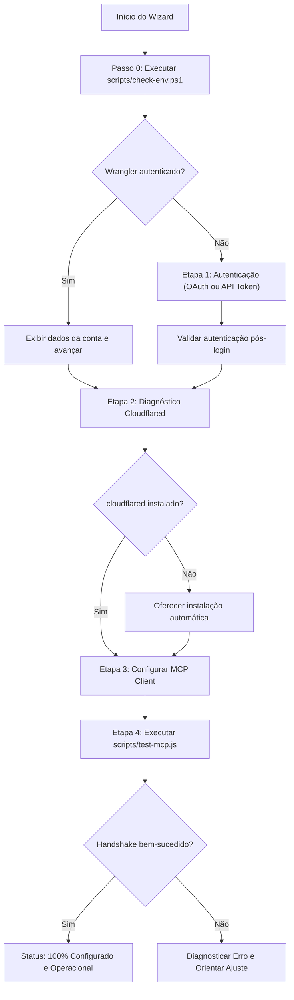

# ☁️ Cloudflare Setup Wizard

Skill interativa para conduzir o desenvolvedor através do diagnóstico, instalação, autenticação e configuração do ecossistema Cloudflare e do servidor MCP oficial (`@cloudflare/mcp-server-cloudflare`) no projeto.

---

## 🏛️ Racional de Engenharia (Cognitivo vs. Determinístico)

- **🧠 Camada Cognitiva (LLM):** Conduz o diálogo com o usuário, interpreta respostas, orienta decisões (OAuth vs API Token, túneis locais) e formata as instruções.
- **⚙️ Camada Determinística (Scripts):** Scripts locais em `scripts/` executam testes de ambiente e handshake JSON-RPC sem alucinações.



---

## 📋 Fluxo de Execução Passo a Passo

### Etapa 0: Sondagem Inicial Silenciosa (Determinística)

Antes de enviar perguntas desnecessárias ao usuário, execute o script de diagnóstico do ambiente:

```powershell
powershell -ExecutionPolicy Bypass -File .\.agents\skills\cloudflare-setup-wizard\scripts\check-env.ps1
```

O script retorna um JSON estruturado com:
- `node.installed` e `node.version`
- `wrangler.installed`, `wrangler.version`, `wrangler.authenticated`, `wrangler.email`, `wrangler.accountId`
- `cloudflared.installed` e `cloudflared.version`
- `env.hasApiToken` e `env.hasAccountId`

Analise o JSON retornado para decidir o próximo passo.

---

### Etapa 1: Autenticação da Conta Cloudflare

#### Cenário A: Sessão Ativa Detectada
Se `wrangler.authenticated` for `true`:
- Informe ao usuário:
  > *"Sessão ativa detectada para a conta `[email]` (Account ID: `[accountId]`)."*
- Avance diretamente para a **Etapa 2**.

#### Cenário B: Sem Sessão Ativa
Apresente as duas opções de autenticação:
1. **Login no Navegador (Recomendado para Dev Local):**
   - Execute no terminal:
     ```powershell
     npx --yes wrangler login
     ```
   - Aguarde a autorização no navegador e confirme com `npx wrangler whoami`.
2. **API Token (Para ambientes Headless / CI/CD):**
   - Peça ao usuário o `CLOUDFLARE_API_TOKEN` e `CLOUDFLARE_ACCOUNT_ID`.
   - Adicione ao `.env` do projeto:
     ```env
     CLOUDFLARE_API_TOKEN="seu_token_aqui"
     CLOUDFLARE_ACCOUNT_ID="seu_account_id_aqui"
     ```

---

### Etapa 2: Utilitário de Túneis Locais (`cloudflared`)

Verifique o campo `cloudflared.installed`:

#### Cenário A: `cloudflared` já está presente
- Confirme a versão detectada e avance para a **Etapa 3**.

#### Cenário B: `cloudflared` ausente
- Pergunte ao usuário se deseja instalar o `cloudflared` para criar túneis públicos seguros para MCP local:
  - **Instalação Automática no Windows:**
    ```powershell
    winget install --id Cloudflare.cloudflared
    ```
  - **macOS:** `brew install cloudflared`
  - **Linux:** `sudo apt-get install cloudflared`
  - Se o usuário preferir não instalar no momento, avance para a **Etapa 3**.

---

### Etapa 3: Integração do Servidor MCP com Clientes de IA

Forneça a configuração do servidor `@cloudflare/mcp-server-cloudflare` para o cliente de IA utilizado:

#### 1. Claude Desktop (`claude_desktop_config.json`)
Localização:
- **Windows:** `%APPDATA%\Claude\claude_desktop_config.json`
- **macOS:** `~/Library/Application Support/Claude/claude_desktop_config.json`

```json
{
  "mcpServers": {
    "cloudflare": {
      "command": "npx",
      "args": ["-y", "@cloudflare/mcp-server-cloudflare", "run", "<SEU_ACCOUNT_ID>"]
    }
  }
}
```

#### 2. Antigravity / Gemini IDE / Cursor (`mcp_config.json` ou `.cursor/mcp.json`)
```json
{
  "mcpServers": {
    "cloudflare": {
      "command": "npx",
      "args": ["-y", "@cloudflare/mcp-server-cloudflare", "run", "<SEU_ACCOUNT_ID>"]
    }
  }
}
```

> **Nota Importante:** O argumento `<SEU_ACCOUNT_ID>` (ou variável `CLOUDFLARE_ACCOUNT_ID`) é obrigatório para o comando `run`.

---

### Etapa 4: Validação da Conexão MCP (Smoke Test)

Execute o script de teste determinístico do MCP:

```powershell
node .\.agents\skills\cloudflare-setup-wizard\scripts\test-mcp.js
```

O script inicializa o servidor MCP via stdio, conclui o handshake JSON-RPC 2.0 (`initialize` e `notifications/initialized`), faz a listagem de ferramentas (`tools/list`) e exibe o resumo com as dezenas de ferramentas habilitadas:
- **Workers & Workflows:** `template_create_worker`, `route_create`, `workflow_create`, `cron_create`, `secret_put`
- **Banco de Dados & Storage:** `d1_query`, `d1_create_database`, `r2_create_bucket`, `r2_put_object`, `do_create_namespace`
- **Workers AI:** `ai_inference`, `ai_embeddings`, `ai_text_generation`, `ai_image_generation`
- **Filas & Mensageria:** `queue_create`, `queue_send_message`

Exiba a confirmação final de prontidão com os próximos comandos recomendados.
