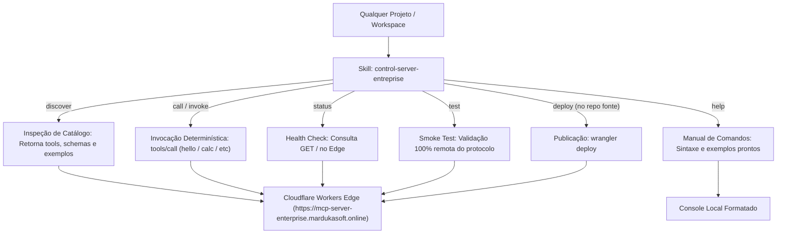

# 🎛️ Control Server Enterprise (Portátil & Auto-Contido)

Skill **100% auto-contida e independente de código-fonte local**. Permite que qualquer projeto ou agente de IA descubra ferramentas, inspecione schemas, invoque cálculos determinísticos e consulte a integridade do servidor **`mcp-server-enterprise`** hospedado no Cloudflare Workers Edge.

---

## 🏛️ Racional de Engenharia (Cognitivo vs. Determinístico)

- **🧠 Camada Cognitiva (LLM):** Extrai a intenção do usuário em linguagem natural e delega a execução das ferramentas para a skill determinística.
- **⚙️ Camada Determinística (Scripts Auto-Contidos):** Conecta diretamente via JSON-RPC 2.0 / HTTP ao Cloudflare Workers Edge, eliminando alucinações matemáticas ou de formatação temporal.



---

## 📦 Como Usar Esta Skill em Outros Projetos

Para disponibilizar o servidor MCP Enterprise e esta skill em qualquer outro repositório:

### 1. Registrar no Cliente MCP do Projeto (`mcp_config.json` ou `.agents/mcp_config.json`)
```json
{
  "mcpServers": {
    "mcp-server-enterprise": {
      "url": "https://mcp-server-enterprise.mardukasoft.online"
    }
  }
}
```

### 2. Copiar a pasta da Skill
Basta copiar a pasta `control-server-entreprise/` para a pasta de skills do seu projeto (`.agents/skills/control-server-entreprise/`) ou para as skills globais (`~/.gemini/config/skills/control-server-entreprise/`).

---

## 🛠️ Catálogo de Funções

### 1. `discover` (Descoberta Dinâmica de Ferramentas e Schemas)
Consulta o catálogo de ferramentas ativas no Edge e exibe de forma legível seus schemas JSON, resumos, diretrizes e exemplos de uso:

```powershell
powershell -ExecutionPolicy Bypass -File .\.agents\skills\control-server-entreprise\scripts\control.ps1 -Action discover
```

---

### 2. `help` (Manual de Uso e Exemplos Rápidos)
Exibe a lista de todos os comandos disponíveis com exemplos prontos para copiar e colar:

```powershell
powershell -ExecutionPolicy Bypass -File .\.agents\skills\control-server-entreprise\scripts\control.ps1 -Action help
```

---

### 3. `call` / `invoke` (Invocação Determinística de Ferramentas)
Invoca diretamente as ferramentas do Cloudflare Workers sem intermediários:

```powershell
# 1. Ferramenta 'hello' (Saudação com Timestamp ISO 8601 UTC)
powershell -ExecutionPolicy Bypass -File .\.agents\skills\control-server-entreprise\scripts\control.ps1 -Action call -Tool hello -ArgsJson "{'name': 'Eduardo Rezende'}"

# 2. Ferramenta 'calc' (Cálculo Determinístico Exato)
powershell -ExecutionPolicy Bypass -File .\.agents\skills\control-server-entreprise\scripts\control.ps1 -Action call -Tool calc -ArgsJson "{'valor1': 250, 'valor2': 5, 'operacao': '/'}"

# 3. Ferramenta 'discover'
powershell -ExecutionPolicy Bypass -File .\.agents\skills\control-server-entreprise\scripts\control.ps1 -Action call -Tool discover
```

---

### 4. `status` (Health Check Remoto)
Consulta o endpoint e exibe status, runtime e lista de tools ativas:

```powershell
powershell -ExecutionPolicy Bypass -File .\.agents\skills\control-server-entreprise\scripts\control.ps1 -Action status
```

---

### 5. `test` (Smoke Test Remoto Auto-Contido)
Executa 4 testes protocolares completos (`GET /`, `initialize`, `tools/list`, `tools/call`) diretamente contra o Cloudflare Workers:

```powershell
powershell -ExecutionPolicy Bypass -File .\.agents\skills\control-server-entreprise\scripts\control.ps1 -Action test
```

---

### 6. `deploy` (Atualização no Cloudflare Workers)
> **Nota:** Esta função requer os arquivos de código-fonte do servidor (`wrangler.toml`, `src/entry.py`) e é executada no repositório `mcp-server-enterprise-blueprint`.

```powershell
powershell -ExecutionPolicy Bypass -File .\.agents\skills\control-server-entreprise\scripts\control.ps1 -Action deploy
```

---

## 🌐 Endpoint de Produção

- **URL:** `https://mcp-server-enterprise.danicardoso-3011.workers.dev`
- **Ferramentas Ativas:** `discover`, `hello`, `calc`
- **Protocolo:** JSON-RPC 2.0 / MCP Serverless Edge
