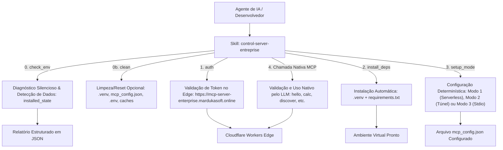

# 🎛️ Control Server Enterprise (Portátil, Auto-Contido & Extensível)

Skill **100% auto-contida e independente de código-fonte local**. Permite que qualquer agente de IA ou desenvolvedor conduza o onboarding completo, valide tokens/licenças remotamente, diagnostique gaps no ambiente, instale dependências, resete/reinstale ambientes, configure os 3 modos de execução (Serverless 24/7, Túnel Remoto HTTPS ou Local Stdio Puro), sincronize segredos e gere scaffolding para novas ferramentas.

> **Importante:** As ferramentas de negócio (`calc`, `hello`, `sqlite`, `redis`, `discover`, `benchmark_cost`, etc.) pertencem **exclusivamente à camada do protocolo MCP** e são executadas **100% nativamente pelo LLM**. O script determinístico `control.ps1` é restrito à infraestrutura, onboarding e diagnóstico.

---

## 🏛️ Racional de Engenharia (Camada Cognitiva vs. Determinística)

- **🧠 Camada Cognitiva (LLM / Agente):** Conduz o diálogo com o desenvolvedor, solicita o token, orienta a escolha do modo de execução e **invoca nativamente as ferramentas MCP** via protocolo.
- **⚙️ Camada Determinística (Scripts Auto-Contidos de Infraestrutura):** Executa validações de token via JSON-RPC no Edge (`https://mcp-server-enterprise.mardukasoft.online`), limpa `.venv`/configs em caso de reset, sonda o ambiente, configura túneis e escreve `mcp_config.json` sem alucinações.



---

## 🚀 Guia de Onboarding & Instalação para Agentes de IA

Quando o usuário pedir para **instalar**, **configurar** ou **onboardar** o repositório clonado:

### Passo 0: Diagnóstico Inicial e Verificação de Instalação Prévia
1. O Agente sonda o ambiente executando:
   ```powershell
   powershell -ExecutionPolicy Bypass -File .\.agents\skills\control-server-entreprise\scripts\control.ps1 -Action check_env -JsonOutput
   ```
2. O Agente verifica o campo `installed_state.already_configured`:
   - Se for `true` (já existe `.venv`, `.env` ou `mcp_config.json`), o Agente pergunta amigavelmente no chat:
     > *"Detectei que este repositório já possui uma configuração ou ambiente prévio. Deseja **reinstalar do zero** (limpando o ambiente virtual e reconfigurando tudo) ou **manter a instalação atual**?"*
   - Se o usuário optar por **reinstalar**, o Agente executa a limpeza determinística:
     ```powershell
     powershell -ExecutionPolicy Bypass -File .\.agents\skills\control-server-entreprise\scripts\control.ps1 -Action clean -Force
     ```
     E então avança para o Passo 1 com ambiente totalmente limpo.
   - Se optar por manter ou se `already_configured` for `false`, prossegue normalmente.

---

### Passo 1: Solicitação e Validação do Token de Acesso
1. O Agente **solicita obrigatoriamente o Token de Acesso / Licença ao usuário no chat** (nunca assumindo tokens antigos silenciosamente após uma limpeza). Caso o usuário ainda não possua, o agente orienta a abrir o portal no navegador: `https://mcp-server-enterprise.mardukasoft.online`.
2. O Agente valida o token fornecido deterministicamente chamando:
   ```powershell
   powershell -ExecutionPolicy Bypass -File .\.agents\skills\control-server-entreprise\scripts\control.ps1 -Action auth -Token "<TOKEN_DO_USUARIO>"
   ```
3. Se `valid` for `true`, o agente prossegue para o Passo 2.

---

### Passo 2: Resolução de Dependências
1. Se houver pacotes ausentes ou ambiente recém-limpo, o Agente pergunta: *"Deseja instalar as dependências agora?"*.
2. Com a confirmação, executa:
   ```powershell
   powershell -ExecutionPolicy Bypass -File .\.agents\skills\control-server-entreprise\scripts\control.ps1 -Action install_deps
   ```

---

### Passo 3: Seleção Obrigatória do Modo de Execução (Sem Default)
O Agente apresenta os 3 modos de forma concisa e aguarda a decisão explícita do desenvolvedor (não há valor default assumido):
- **[1] ☁️ Serverless Edge:** 24/7 na Cloudflare (Acesso direto HTTP/SSE com Token de Produção).
- **[2] 🚇 Túnel Remoto:** Python Local + Túnel HTTPS automático (`cloudflared` + Token).
- **[3] ⚡ Local Stdio:** 100% no computador para IDEs locais via `.venv`.

Após a escolha do usuário, o Agente executa a configuração determinística com o modo selecionado:
```powershell
# Exemplo para Modo 1 (Serverless Edge)
powershell -ExecutionPolicy Bypass -File .\.agents\skills\control-server-entreprise\scripts\control.ps1 -Action setup_mode -Mode 1 -Token "<TOKEN>"

# Exemplo para Modo 2 (Túnel Remoto HTTPS)
powershell -ExecutionPolicy Bypass -File .\.agents\skills\control-server-entreprise\scripts\control.ps1 -Action setup_mode -Mode 2 -Token "<TOKEN>"

# Exemplo para Modo 3 (Local Stdio Puro)
powershell -ExecutionPolicy Bypass -File .\.agents\skills\control-server-entreprise\scripts\control.ps1 -Action setup_mode -Mode 3
```

---

### Passo 4: Validação Nativa via MCP & Confirmação de Prontidão
Após a configuração do modo, o Agente **NÃO executa comandos CLI locais para testar tools**. A validação é feita **100% nativamente pelo LLM via protocolo MCP**, executando uma chamada real de teste (ex: `hello` ou `calc`) contra o servidor e confirmando a resposta ao desenvolvedor:

- **Exemplo de Teste de Prontidão pelo LLM:**
  - 👉 O Agente invoca a tool nativa MCP `hello(name="Desenvolvedor")` ou `calc(valor1=10, valor2=2, operacao="*")`.
  - 👉 Recebe o resultado do servidor no Cloudflare Edge.
  - 👉 Apresenta a confirmação no chat: *"Servidor MCP Enterprise configurado, testado e pronto para uso!"*.

---

## 💬 Experiência do Desenvolvedor (100% LLM & Linguagem Natural)

O desenvolvedor **nunca precisa executar comandos CLI para usar ferramentas**. A interação é feita em linguagem natural diretamente no chat com a IA:

- **Usuário:** *"Quanto é 150 dividido por 25?"* 
  👉 **LLM:** Chama a tool `calc(valor1=150, valor2=25, operacao='/')` e devolve `6`.
- **Usuário:** *"Faça uma simulação de financiamento de 100k em 120 meses a 10% ao ano"* 
  👉 **LLM:** Chama a tool `benchmark_cost(...)` e gera a tabela completa.
- **Usuário:** *"Crie uma tabela de tarefas e insira 3 itens no SQLite"* 
  👉 **LLM:** Chama a tool `sqlite(...)` deterministicamente.
- **Usuário:** *"Quais ferramentas você tem disponíveis no servidor?"* 
  👉 **LLM:** Chama a tool `discover()` e lista as capacidades em tempo real.

---

## 🛠️ Ações Internas do Script de Infraestrutura (`control.ps1`)

> **Nota:** O script `control.ps1` é estritamente dedicado à infraestrutura e automação de ambiente. Não executa ferramentas de negócio do MCP.

| Ação | Finalidade |
| :--- | :--- |
| **`install` / `onboard`** | Esteira completa de onboarding (reset opcional, diagnóstico, deps, modo obrigatório e status) |
| **`check_env`** | Sonda gaps de sistema e dados pré-existentes (`installed_state`) |
| **`clean`** | Reseta/limpa `.venv`, `mcp_config.json`, `.env`, `.dev.vars`, `.wrangler` e logout |
| **`auth`** | Valida remotamente o Bearer Token no Cloudflare Edge durante o setup |
| **`install_deps`** | Cria `.venv` e instala dependências do `requirements.txt` e modo editável |
| **`setup_mode`** | Configura `mcp_config.json` para Modo 1, 2 ou 3 (**seleção obrigatória, sem valor default**) |
| **`status`** | Consulta a saúde HTTP, latência e metadados da instância online |
| **`deploy`** | Publica o Worker no Cloudflare Edge via Wrangler |
| **`create_tool`** | Gera scaffolding completo de nova tool a partir do template canônico |
| **`sync_secrets`** | Sincroniza segredos de `.dev.vars` / `.env` diretamente para o Cloudflare Workers |
