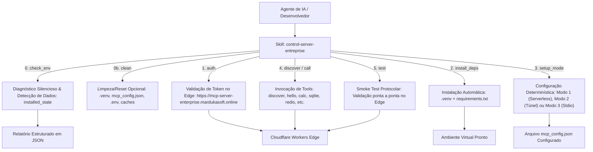

# 🎛️ Control Server Enterprise (Portátil, Auto-Contido & Extensível)

Skill **100% auto-contida e independente de código-fonte local**. Permite que qualquer agente de IA ou desenvolvedor conduza o onboarding completo, valide tokens/licenças remotamente, diagnostique gaps no ambiente, instale dependências, resete/reinstale ambientes, configure os 3 modos de execução (Serverless 24/7, Túnel Remoto HTTPS ou Local Stdio Puro) e invoque ferramentas determinísticas contra o servidor **`mcp-server-enterprise`** no Cloudflare Workers Edge.

---

## 🏛️ Racional de Engenharia (Camada Cognitiva vs. Determinística)

- **🧠 Camada Cognitiva (LLM / Agente):** Conduz o diálogo com o desenvolvedor, verifica dados existentes, pergunta se deseja reinstalar, solicita o token, exibe relatórios claros e orienta a escolha do modo de execução.
- **⚙️ Camada Determinística (Scripts Auto-Contidos & Protocolo MCP):** Executa validações de token via JSON-RPC 2.0 no Edge (`https://mcp-server-enterprise.mardukasoft.online`), limpa `.venv`/configs em caso de reset, sonda o ambiente, configura túneis e escreve `mcp_config.json` sem alucinações.



---

## 🚀 Guia de Onboarding & Instalação para Agentes de IA

Quando o usuário pedir para **instalar**, **configurar** ou **onboardar** o repositório clonado:

### Passo 0: Diagnóstico Inicial e Verificação de Instalação Prévia
1. O Agente sonda o ambiente executando:
   ```powershell
   powershell -ExecutionPolicy Bypass -File .\.agents\skills\control-server-entreprise\scripts\control.ps1 -Action check_env -JsonOutput
   ```
2. O Agente verifica o campo `installed_state.already_configured`:
   - Se for `true` (já existe `.venv`, `.env` ou `mcp_config.json`), o Agente pergunta amigavelmente no chat:
     > *"Detectei que este repositório já possui uma configuração ou ambiente prévio. Deseja **reinstalar do zero** (limpando o ambiente virtual e reconfigurando tudo) ou **manter a instalação atual**?"*
   - Se o usuário optar por **reinstalar**, o Agente executa a limpeza determinística:
     ```powershell
     powershell -ExecutionPolicy Bypass -File .\.agents\skills\control-server-entreprise\scripts\control.ps1 -Action clean -Force
     ```
     E então avança para o Passo 1 com ambiente totalmente limpo.
   - Se optar por manter ou se `already_configured` for `false`, prossegue normalmente.

---

### Passo 1: Solicitação e Validação do Token de Acesso
1. O Agente solicita o Token de Acesso / Licença ao usuário (ou orienta a abrir o portal no navegador: `https://mcp-server-enterprise.mardukasoft.online`).
2. O Agente valida o token deterministicamente chamando:
   ```powershell
   powershell -ExecutionPolicy Bypass -File .\.agents\skills\control-server-entreprise\scripts\control.ps1 -Action auth -Token "<TOKEN_DO_USUARIO>"
   ```
3. Se `valid` for `true`, o agente prossegue para o Passo 2.

---

### Passo 2: Resolução de Dependências
1. Se houver pacotes ausentes ou ambiente recém-limpo, o Agente pergunta: *"Deseja instalar as dependências agora?"*.
2. Com a confirmação, executa:
   ```powershell
   powershell -ExecutionPolicy Bypass -File .\.agents\skills\control-server-entreprise\scripts\control.ps1 -Action install_deps
   ```

---

### Passo 3: Seleção do Modo de Execução
O Agente apresenta os 3 modos de forma concisa e colorida:
- **[1] ☁️ Serverless Edge:** 24/7 na Cloudflare (Deploy automático via Wrangler).
- **[2] 🚇 Túnel Remoto:** Python Local + Túnel HTTPS automático (`cloudflared`).
- **[3] ⚡ Local Stdio:** 100% no computador para IDEs locais (Padrão).

Após a escolha do usuário, o Agente executa a configuração automática:
```powershell
# Exemplo para Modo 2 (Túnel)
powershell -ExecutionPolicy Bypass -File .\.agents\skills\control-server-entreprise\scripts\control.ps1 -Action setup_mode -Mode 2 -Token "<TOKEN>"

# Exemplo para Modo 3 (Local Stdio)
powershell -ExecutionPolicy Bypass -File .\.agents\skills\control-server-entreprise\scripts\control.ps1 -Action setup_mode -Mode 3
```

---

### Passo 4: Smoke Test e Confirmação de Prontidão
O Agente executa o teste protocolar para confirmar que o servidor responde perfeitamente:
```powershell
powershell -ExecutionPolicy Bypass -File .\.agents\skills\control-server-entreprise\scripts\control.ps1 -Action test
```

---

## 🛠️ Catálogo Completo de Ações da Skill

| Ação | Finalidade | Exemplo de Comando |
| :--- | :--- | :--- |
| **`check_env`** | Sonda gaps e dados pré-existentes (`installed_state`) | `powershell -File control.ps1 -Action check_env -JsonOutput` |
| **`clean`** | Reseta/limpa `.venv`, `mcp_config.json`, `.env` e caches | `powershell -File control.ps1 -Action clean -Force` |
| **`auth`** | Valida remotamente o Bearer Token no Cloudflare Edge | `powershell -File control.ps1 -Action auth -Token "mcp_live_..."` |
| **`install_deps`** | Cria `.venv` e instala dependências do `requirements.txt` | `powershell -File control.ps1 -Action install_deps` |
| **`setup_mode`** | Configura automaticamente o `mcp_config.json` para Modo 1, 2 ou 3 | `powershell -File control.ps1 -Action setup_mode -Mode 2 -Token "..."` |
| **`discover`** | Consulta o catálogo dinâmico de ferramentas e schemas no Edge | `powershell -File control.ps1 -Action discover` |
| **`call`** | Invoca uma ferramenta determinística via JSON-RPC | `powershell -File control.ps1 -Action call -Tool hello -ArgsJson '{"name":"Eduardo"}'` |
| **`status`** | Consulta a saúde e metadados da instância online | `powershell -File control.ps1 -Action status` |
| **`test`** | Executa validação protocolar ponta a ponta | `powershell -File control.ps1 -Action test` |
| **`deploy`** | Publica o Worker no Cloudflare Edge via Wrangler | `powershell -File control.ps1 -Action deploy` |
