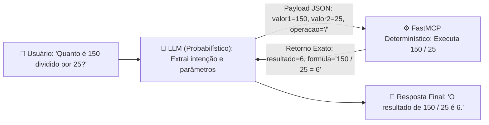
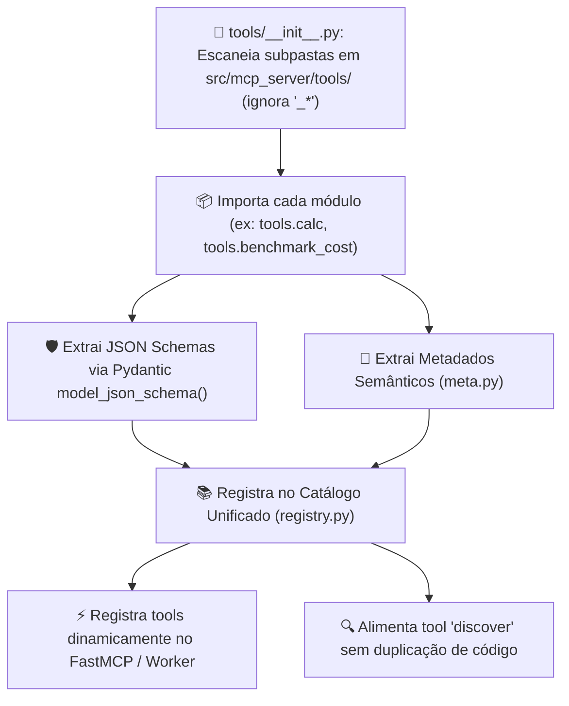
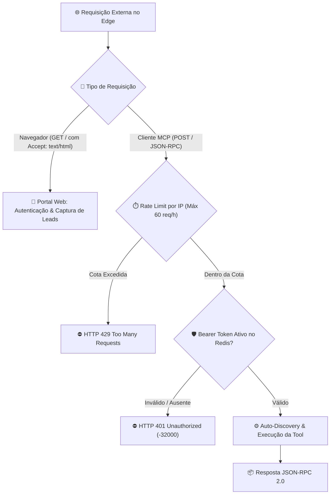
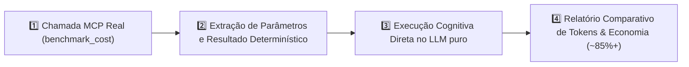

# ⚡ mcp-server-enterprise-blueprint

> **Tech Lead Note:**
> Subir um servidor MCP básico leva menos de 10 minutos e exige pouquíssimo código. Tutoriais mostrando apenas a sintaxe de conexão você encontra em qualquer lugar.
>
> O que realmente importa — e o que construímos aqui — é o **racional de engenharia**: 
> 1. **Como usar**: arquitetura limpa, modularidade estrita (*Screaming Architecture*), tipagem forte e separação clara de responsabilidades.
> 2. **Por que usar**: governança corporativa, segurança perimetral, validação determinística e redução drástica de consumo de contexto/tokens.
> 3. **Quando usar**: critérios práticos para identificar quando o MCP é a ferramenta certa para o seu problema de negócio (e quando ele é exagero).

---

## 🚀 Quick Start & Onboarding com Agentes de IA (Skill Integrada)

Ao abrir este repositório no seu ambiente de IA (Antigravity, Cursor, Claude Code, Gemini IDE), o próprio **Agente (Camada Cognitiva)** conduz o onboarding passo a passo usando a skill [`control-server-entreprise`](file:///c:/Users/rezen/Documents/GitHub/mcp-server-enterprise-blueprint/.agents/skills/control-server-entreprise/SKILL.md):

Basta solicitar ao seu agente no chat:
> *"Instale e configure o servidor MCP Enterprise neste projeto"*

Ou executar o fluxo determinístico diretamente via terminal:
```powershell
powershell -ExecutionPolicy Bypass -File ./.agents/skills/control-server-entreprise/scripts/control.ps1 -Action install
```

O onboarding conduz deterministicamente pelas etapas:
1. **Detecção Inicial & Opção de Reinstalação:** Sondagem de dados pré-existentes (`.venv`, `mcp_config.json`, `.env`), oferecendo limpeza/reset completo (`clean -Force`) caso o usuário deseje reinstalar do zero.
2. **Validação de Token & Acesso:** Validação remota contra o servidor central no Cloudflare Edge (`https://mcp-server-enterprise.mardukasoft.online`).
3. **Instalação Automática de Dependências:** Criação de ambiente virtual e instalação dos pacotes necessários.
4. **Seleção do Modo de Execução:**
   - **Modo 1:** *Serverless Cloudflare Edge 24/7* (deploy serverless gratuito).
   - **Modo 2:** *Local Remoto com Túnel Cloudflare* (`cloudflared` + SSE para conectar LLMs na nuvem).
   - **Modo 3:** *Local Puro* (FastMCP Stdio direto na máquina para Antigravity, Cursor e Claude Desktop).
5. **Smoke Test & Configuração de Clientes:** Validação de handshake e geração do [mcp_config.json](file:///c:/Users/rezen/Documents/GitHub/mcp-server-enterprise-blueprint/mcp_config.json).

---

## 🏛️ 1. Racional de Engenharia: Camada Cognitiva vs. Determinística

- **🧠 Camada Cognitiva (LLM):** Raciocínio, interpretação semântica de linguagem natural e extração de intenções do usuário (probabilístico).
- **⚙️ Camada Determinística (FastMCP / Python):** Validação estrita de contratos ([Pydantic v2](file:///c:/Users/rezen/Documents/GitHub/mcp-server-enterprise-blueprint/src/mcp_server/schemas/base.py)), queries parametrizadas, regras de negócio isoladas e retorno exato sem risco de alucinação (100% previsível e testável).



---

## 🛠️ 2. Catálogo Oficial de Ferramentas (Tools)

O servidor dispõe de um catálogo modular de ferramentas determinísticas de alta performance:

| Ferramenta | Descrição | Entrada (Input Schema) | Saída (Output) |
| :--- | :--- | :--- | :--- |
| **[`discover`](file:///c:/Users/rezen/Documents/GitHub/mcp-server-enterprise-blueprint/src/mcp_server/tools/discover)** | Inspeção dinâmica do catálogo de ferramentas, metadados e schemas JSON em runtime | `{}` | `{"total": int, "tools": [...]}` |
| **[`hello`](file:///c:/Users/rezen/Documents/GitHub/mcp-server-enterprise-blueprint/src/mcp_server/tools/hello)** | Validação temporal e saudação determinística com timestamp ISO 8601 UTC | `{"name": str}` | `{"message": str, "timestamp": str}` |
| **[`calc`](file:///c:/Users/rezen/Documents/GitHub/mcp-server-enterprise-blueprint/src/mcp_server/tools/calc)** | Aritmética determinística com proteção contra divisão por zero | `{"valor1": float, "valor2": float, "operacao": "+|-|*|/"}` | `{"resultado": float, "formula": str}` |
| **[`sqlite`](file:///c:/Users/rezen/Documents/GitHub/mcp-server-enterprise-blueprint/src/mcp_server/tools/sqlite)** | Execução determinística de consultas SQL e operações CRUD parametrizadas | `{"action": "query|insert|select|update|delete", ...}` | `{"success": bool, "rows": [...], "rows_affected": int}` |
| **[`redis`](file:///c:/Users/rezen/Documents/GitHub/mcp-server-enterprise-blueprint/src/mcp_server/tools/redis)** | Operações em Redis (Key-Value, Hashes, Sets, TTLs, Ping) com suporte a Upstash REST API Edge | `{"action": "ping|get|set|del|hgetall|sadd", ...}` | `{"success": bool, "result": any, ...}` |
| **[`auth`](file:///c:/Users/rezen/Documents/GitHub/mcp-server-enterprise-blueprint/src/mcp_server/tools/auth)** | Gestão de ciclo de vida de tokens Bearer (`mcp_live_`), emissão, cadastro de leads e validação $O(1)$ | `{"action": "setup|token_generator|set_token|get_token", ...}` | `{"success": bool, "token": str, "is_valid": bool, ...}` |
| **[`send_mail`](file:///c:/Users/rezen/Documents/GitHub/mcp-server-enterprise-blueprint/src/mcp_server/tools/send_mail)** | Disparo transacional de credenciais de acesso via Resend API (HTTPS Edge) ou Gmail SMTP | `{"to_email": str, "recipient_name": str, "token": str}` | `{"success": bool, "message": str, "delivery_mode": str}` |
| **[`benchmark_cost`](file:///c:/Users/rezen/Documents/GitHub/mcp-server-enterprise-blueprint/src/mcp_server/tools/benchmark_cost)** | Simulação financeira (SAC/PRICE) com parâmetros automáticos e medição de economia de tokens | `{"principal"?: float, "taxa_anual"?: float, "meses"?: int, ...}` | `{"params_usados": {...}, "resumo_financeiro": {...}, ...}` |

---

## 🏗️ 3. Arquitetura Modular & Auto-Discovery (*Zero-Drift*)

A organização do código segue o padrão **Screaming Architecture**: cada ferramenta reside em seu próprio módulo encapsulado dentro de [`src/mcp_server/tools/`](file:///c:/Users/rezen/Documents/GitHub/mcp-server-enterprise-blueprint/src/mcp_server/tools), eliminando duplicações manuais de schema.

```text
mcp-server-enterprise-blueprint/
├── src/
│   ├── entry.py                    # Handler HTTP para Cloudflare Workers (Pyodide Edge)
│   └── mcp_server/
│       ├── __init__.py             # Pacote principal
│       ├── server.py               # Ponto de entrada FastMCP (stdio / SSE / Workers)
│       ├── registry.py             # Gerenciador do catálogo dinâmico de tools e schemas
│       ├── security.py             # Guarda perimetral de autenticação Bearer e Rate Limiting
│       ├── schemas/                # 🛡️ Schemas Globais e Modelos Base Pydantic v2
│       │   ├── base.py
│       │   └── common.py
│       ├── ui/                     # 🎨 Portal Web e Telas de Autenticação
│       │   └── portal.py
│       └── tools/                  # ⚙️ Módulos Autocontidos das Ferramentas (Auto-Discovery)
│           ├── __init__.py         # Mecanismo dinâmico de varredura e carregamento
│           ├── _template/          # 📐 Template Canônico de Referência
│           │   ├── schema.py       # Contratos Pydantic Input/Output
│           │   ├── handler.py      # Função execute() determinística
│           │   ├── meta.py         # Metadados e heurísticas semânticas para o LLM
│           │   └── __init__.py     # Ponto de exportação único
│           ├── auth/               # 🔐 Gestão de Tokens e Identidade
│           ├── benchmark_cost/     # 📊 Benchmark de Custo e Finanças
│           ├── calc/               # 🧮 Cálculos Aritméticos
│           ├── discover/           # 🔍 Auto-Inspeção do Catálogo
│           ├── hello/              # 👋 Saudação e Temporalidade UTC
│           ├── redis/              # ⚡ Operações Redis / Upstash Edge
│           ├── send_mail/          # 📬 Envio Transacional de E-mails
│           └── sqlite/             # 🗄️ Banco Relacional SQLite
├── scripts/
│   ├── call_tool.py                # Cliente CLI para testes e chamadas rápidas
│   └── create_tool.py              # Gerador de Scaffold automático de novas tools
├── docs/                           # 📚 Especificações Técnicas e Manuais de Arquitetura
├── tests/                          # 🧪 Suíte de Testes Automatizados (pytest)
├── wrangler.toml                   # Configuração de Deploy no Cloudflare Workers
├── pyproject.toml                  # Dependências e Metadados do Pacote Python
└── AGENTS.md                       # 📜 Diretrizes e Protocolos Estritos para Agentes de IA
```

### O Fluxo de Carregamento Dinâmico:



### Criando Novas Ferramentas em Segundos

Utilize o scaffold automatizado para gerar novas ferramentas aderentes ao contrato dos 4 arquivos:

```bash
# Gerar uma nova ferramenta chamada 'cotacao_moeda'
python scripts/create_tool.py cotacao_moeda --desc "Consulta cotações de moedas em tempo real"
```

---

## 🔐 4. Segurança Perimetral, Autenticação & Rate Limiting

O servidor exposto no Cloudflare Workers Edge implementa segurança em múltiplas camadas:

1. **⏱️ Rate Limit Perimetral:** Proteção contra abusos limitando a **60 requisições/hora por IP** (`CF-Connecting-IP`), retornando `HTTP 429` com código JSON-RPC `-32029`.
2. **🛡️ Bearer Token Guard:** Validação obrigatória de cabeçalho `Authorization: Bearer mcp_live_<token>`.
3. **⚡ Validação Dinâmica $O(1)$ no Redis:** Consulta instantânea do status do token no Redis (Upstash REST API no Edge ou In-Memory Engine local).
4. **🔒 Rejeição Rápida:** Requisições inválidas ou não autorizadas são bloqueadas no perímetro retornando `HTTP 401` com código `-32000`.



---

## 🎨 5. Portal Web & Captura de Leads

O servidor inclui uma interface moderna servida diretamente na raiz (`GET /`) quando acessado via navegador:
- **Autoatendimento:** Usuários e desenvolvedores podem cadastrar seu nome e e-mail para receber um Bearer Token instantâneo.
- **Login Social Google (GIS):** Autenticação em 1 clique via Google Identity Services.
- **Entrega Transacional:** Credenciais enviadas por e-mail com instruções prontas de configuração para Cursor e Claude Desktop.

---

## 📊 6. Protocolo de Benchmark de Custo de Tokens (Alias: `comparativo_token_cost`)

O servidor inclui uma ferramenta avançada de telemetria e benchmarking (`benchmark_cost`) para mensurar e demonstrar visualmente a economia gerada pela abordagem MCP:



- **Sem MCP (LLM Cognitivo Puro):** Exige alto consumo de tokens de raciocínio (Chain-of-Thought), gera tabelas extensas no output e apresenta risco real de erro em cálculos financeiros.
- **Com FastMCP (Determinístico):** O LLM gera apenas uma chamada concisa de ferramenta (~15 tokens) e recebe o resultado exato e estruturado em milissegundos, gerando uma **economia típica de 80% a 95% em tokens**.

---

## 🚀 7. Como Conectar e Usar no seu Cliente de IA

### Claude Desktop / Cursor / Antigravity

Adicione o servidor à configuração de MCP (`mcp_config.json` ou `.agents/mcp_config.json`):

```json
{
  "mcpServers": {
    "mcp-server-enterprise": {
      "url": "https://mcp-server-enterprise.danicardoso-3011.workers.dev",
      "headers": {
        "Authorization": "Bearer SEU_TOKEN_AQUI"
      }
    }
  }
}
```

> **Obtenha seu token:** Acesse `https://mcp-server-enterprise.danicardoso-3011.workers.dev` no navegador para gerar sua chave de acesso em segundos.

---

## ☁️ 8. Deploy no Cloudflare Workers Edge (100% Python Serverless)

O servidor é executado no runtime nativo Python/Pyodide da Cloudflare:

```bash
# 1. Instalar dependências locais
pip install -r requirements.txt

# 2. Executar testes de validação
pytest -v

# 3. Sincronizar segredos com a Cloudflare (executar uma única vez ou quando mudar chaves)
python scripts/sync_secrets.py

# 4. Deploy no Cloudflare Workers
npx wrangler deploy
```

- **Endpoint de Produção:** `https://<seu-worker>.<seu-subdominio>.workers.dev`
- **Domínio Personalizado (Opcional):** Configurado na seção `routes` do `wrangler.toml`

---

## 🧪 9. Qualidade e Testes Automatizados

A base de código possui **100% de cobertura funcional** com 78 testes automatizados:

```bash
# Executar a suíte completa de testes
pytest -v
```

```text
============================= test session starts =============================
collected 78 items

tests/test_auth_tool.py .........                                        [ 10%]
tests/test_benchmark_cost.py ....                                        [ 15%]
tests/test_discovery.py ........                                         [ 25%]
tests/test_mcp_server.py .....                                           [ 32%]
tests/test_redis_tool.py ........                                        [ 42%]
tests/test_security.py ................                                  [ 62%]
tests/test_send_mail_tool.py ........                                    [ 73%]
tests/test_tools.py ..................                                   [ 95%]
tests/test_ui_portal.py ....                                             [100%]

============================= 78 passed in 14.63s =============================
```

---

## 📜 10. Diretrizes para Agentes de IA

Este repositório possui regras estritas de governança para agentes de IA documentadas no [`AGENTS.md`](file:///c:/Users/rezen/Documents/GitHub/mcp-server-enterprise-blueprint/AGENTS.md):
- **Diagramas Mermaid:** Rótulos de nós obrigatoriamente entre aspas duplas `["Texto"]`.
- **Prioridade ao MCP Real:** Chamadas de ferramentas executadas obrigatoriamente no servidor real da Cloudflare.
- **Protocolo de Encerramento:** Executado sob o comando *"tarefa concluida"*.
