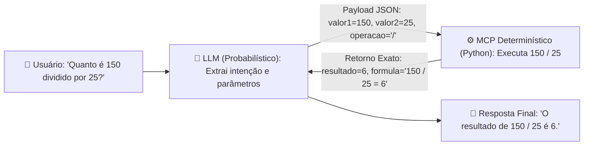

# ⚡ mcp-server-enterprise-blueprint

> **Tech Lead Note:**
> Subir um servidor MCP básico leva menos de 10 minutos e exige pouquíssimo código. Tutoriais mostrando apenas a sintaxe de conexão você encontra em qualquer lugar.
>
> O que realmente importa — e o que construímos aqui — é o **racional de engenharia**: 
> 1. **Como usar**: arquitetura limpa, tipagem estrita e separação clara de responsabilidades.
> 2. **Por que usar**: vantagens reais de governança, segurança de dados e economia de contexto.
> 3. **Quando usar**: critérios práticos para identificar quando o MCP é a ferramenta certa para o seu problema de negócio (e quando ele é exagero).

---

## 🏛️ Racional de Engenharia: Camada Cognitiva vs. Determinística

- **🧠 Camada Cognitiva (LLM):** Raciocínio, interpretação semântica e intenção (probabilística).
- **⚙️ Camada Determinística (MCP / Python):** Validação estrita de tipos, queries parametrizadas, regras de negócio e consumo otimizado de tokens (100% previsível e testável).



---

## 🛠️ Catálogo de Ferramentas (Tools)

| Ferramenta | Descrição | Entrada | Saída |
| :--- | :--- | :--- | :--- |
| **`discover`** | Inspeção dinâmica do catálogo de ferramentas e schemas | `{}` | `{"total": 3, "tools": [...]}` |
| **`hello`** | Saudação determinística com timestamp ISO 8601 UTC | `{"name": "string"}` | `{"message": "string", "timestamp": "ISO 8601"}` |
| **`calc`** | Aritmética determinística com proteção contra divisão por zero | `{"valor1": float, "valor2": float, "operacao": "+|-|*|/"}` | `{"resultado": float, "formula": "string"}` |

---

## 🚀 Como Conectar e Usar no seu Cliente de IA (Cursor / Claude Desktop / Antigravity)

Configure seu arquivo `.agents/mcp_config.json` ou `mcp_config.json`:

```json
{
  "mcpServers": {
    "mcp-server-enterprise": {
      "url": "https://mcp-server-enterprise.mardukasoft.online"
    }
  }
}
```

---

## ☁️ Deploy Serverless no Cloudflare Workers Edge (100% Python)

O servidor pode ser implantado no Cloudflare Workers Edge (runtime Pyodide):

```bash
# Deploy no Cloudflare Workers
npx wrangler deploy
```

- **Endpoint de Produção:** `https://mcp-server-enterprise.danicardoso-3011.workers.dev`
- **Validação Automatizada:** `python scripts/test_cloudflare_worker.py`

---

## 🧪 Testes Automatizados

```bash
# Executar todos os testes unitários e de integração
pytest -v
```
