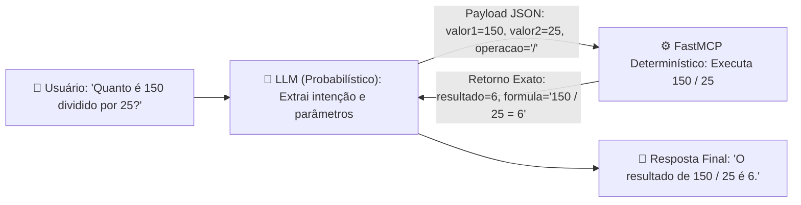
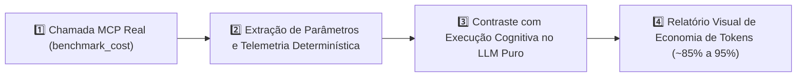

# ⚡ mcp-server-enterprise-blueprint

> **Uma demonstração prática do uso de MCP em arquitetura de sistemas IA / Cognitivos.**

---

### 👨‍💻 Tech Lead Note: O Racional de Engenharia

> *"Subir um servidor MCP básico qualquer tutorial de 10 minutos ensina com poucas linhas de código.*
>
> *O que você encontra aqui é o **racional de engenharia sênior**: como desenhar uma arquitetura que separa rigorosamente a camada probabilística de raciocínio da camada determinística de execução, reduzindo custos em até 95% e garantindo zero alucinação em sistemas corporativos."*

---

## 🚀 Setup Rápido & Requisitos

### Requisitos Mínimos do Ambiente:
* **Python:** `>= 3.10`
* **Node.js:** `>= 20.0`
*(Todas as demais dependências do ecossistema são instaladas de forma 100% automática).*

---

### 🔑 1. Obtenha seu Token de Acesso (Gratuito)
Acesse o portal do servidor no navegador e gere seu Bearer Token em segundos:
👉 **[https://mcp-server-enterprise.mardukasoft.online](https://mcp-server-enterprise.mardukasoft.online)**

---

### ⚡ 2. Instalação & Configuração Automatizada

Você pode instalar todo o ambiente em **1 comando**:

* **Via Chat com seu Agente de IA (Antigravity, Cursor, Claude Code):**
  > *"use a skill control-server-entreprise para instalar e configurar esse projeto"*

* **Ou via Terminal Determinístico (PowerShell):**
  ```powershell
  powershell -ExecutionPolicy Bypass -File ./.agents/skills/control-server-entreprise/scripts/control.ps1 -Action install
  ```

---

### 🌐 3. Conexão Direta ao Servidor em Produção (Sem Instalação Local)

Se você deseja apenas plugar e utilizar o servidor MCP que já está online 24/7 no Edge, adicione a configuração abaixo ao seu `mcp_config.json`:

```json
{
  "mcpServers": {
    "mcp-server-enterprise": {
      "url": "https://mcp-server-enterprise.mardukasoft.online",
      "headers": {
        "Authorization": "Bearer SEU_TOKEN_AQUI"
      }
    }
  }
}
```

---

## ☁️ Modos de Deploy Pré-Configurados

O projeto já vem pronto para rodar em 3 modos de execução flexíveis (utilizando conta gratuita da Cloudflare ou seu ambiente local):

1. **Modo 1 — Serverless Cloudflare Edge 24/7:** Execução global serverless de baixíssima latência e custo zero no Cloudflare Workers.
2. **Modo 2 — Local Remoto com Túnel Cloudflare:** Execução local exposta via `cloudflared` com suporte a SSE para LLMs baseados na nuvem.
3. **Modo 3 — Local Puro (FastMCP Stdio):** Execução nativa via stdio direta na máquina do desenvolvedor (ideal para Antigravity, Cursor e Claude Desktop).

> **Pós-Deploy:** O arquivo [mcp_config.json](file:///c:/Users/rezen/Desktop/hh/mcp-server-enterprise-blueprint/mcp_config.json) gerado automaticamente permite plugar seu servidor em qualquer cliente LLM em segundos.

---

## 🏛️ 1. Racional de Engenharia: Camada Cognitiva vs. Determinística

Um dos maiores erros na construção de agentes de IA é forçar o modelo de linguagem (LLM) a executar cálculos aritméticos, queries ou rotinas binárias diretamente no contexto de inferência.

* **🧠 Camada Cognitiva (LLM):** Raciocínio, interpretação semântica de linguagem natural e extração de intenções do usuário (probabilístico).
* **⚙️ Camada Determinística (FastMCP / Python):** Validação estrita de contratos, cálculos exatos, queries parametrizadas e execução em código sem risco de alucinação (100% previsível, rápido e testável).



---

## 📊 2. Protocolo de Benchmark de Custo de Tokens (Alias: `comparativo_token_cost`)

Sempre que uma tarefa ou prompt frequentemente utilizado puder ser encapsulado em um script determinístico (tool), você transforma raciocínio caro em código de execução instantânea.

### Como testar no chat com sua IA:
Basta enviar o comando:
> `comparativo_token_cost`



* **Sem MCP (LLM Puro):** Consumo elevado de tokens em Chain-of-Thought (CoT), tabelas extensas geradas token a token e risco de erro em regras complexas.
* **Com FastMCP (Determinístico):** Uma única chamada concisa de ferramenta (~15 tokens) que retorna o resultado exato em milissegundos, gerando uma **economia expressiva de 80% a 95% em tokens**.

---

## 🛠️ 3. MCPs são Simples de Usar e Expandir

Adicionar novas capacidades ao seu servidor MCP e colocá-las em produção leva apenas alguns minutos usando instruções em linguagem natural:

### Fluxo Prático de Criação e Deploy:

#### 🔹 1. Criar uma nova ferramenta
> *"crie uma nova tool no mcp-server-enterprise para converter arquivos .md em pdf"*

#### 🔹 2. Publicar no Edge
> *"Faça o deploy"*

#### 🔹 3. Utilizar a ferramenta através da IA
> *"mcp-serve md_to_pdf converta o arquivo README.md"*

*(Em poucos minutos, o seu MCP já converte e compila documentos com custo mínimo de tokens).*

---

### Quer comprovar a economia gerada? Crie um benchmark comparativo:

#### 🔹 4. Replicar a arquitetura de benchmark
> *"replica a tool benchmark_cost e o alias comparativo_token_cost . Para fazer o mesmo comparativo de custo de token com a tool md_to_pdf criando um aliasa no AGENTS.md comparativo_md_to_pdf"*

#### 🔹 5. Publicar a atualização
> *"deploy"*

#### 🔹 6. Executar o benchmark
> *"comparativo_md_to_pdf"*

---

> 💡 **Dica de Infraestrutura:**
> * O fluxo acima foi validado no **Modo 1: Serverless Cloudflare Edge 24/7** (gratuito).
> * É necessário possuir uma conta gratuita na Cloudflare. Caso tenha qualquer dúvida ou problema no setup de credenciais, basta solicitar ao seu assistente:
>   > *"use a skill cloudflare-setup-wizard para configurar o ambiente Cloudflare"*

---

## ⚡ 4. Atalhos e Ajuda Rápida

Comandos úteis para consultar recursos e status a qualquer momento:

| Objetivo | Comando no Chat |
| :--- | :--- |
| **Ajuda da Skill de Controle & Setup** | `use a skill control-server-entreprise help` |
| **Catálogo de Ferramentas do Servidor** | `use o mcp-server-enterprise help` |
