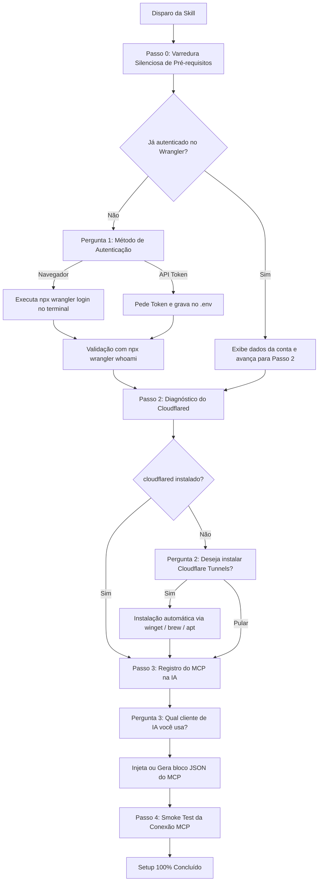

# 📋 Plano de Especificação da Skill: Cloudflare Setup Wizard

> **Status:** Em Revisão / Planejamento  
> **Nome da Skill:** `cloudflare-setup-wizard`  
> **Propósito:** Conduzir o desenvolvedor através de um fluxo conversacional interativo (Wizard) no chat para diagnosticar, instalar, autenticar e configurar ferramentas Cloudflare e o servidor MCP com o máximo de automação possível.

---

## 1. Visão Geral da Arquitetura

A skill opera como um assistente de onboarding guiado por decisões. Ela executa comandos de diagnóstico silenciosamente em segundo plano e só interrompe o usuário para perguntas de decisão estratégica ou onde for necessária interação externa (ex: autorizar no navegador).



---

## 2. Sequência Lógica das Etapas e Automações

### Etapa 0: Sondagem Inicial Silenciosa (Zero Intervenção)
A skill executa verificações de background antes de enviar a primeira mensagem:
- **Node.js**: `node -v` (requisito base).
- **Wrangler / Auth**: `npx wrangler whoami` (verifica se já há sessão ativa e extrai o `Account ID`).
- **Cloudflared**: `cloudflared --version` (verifica se o binário de túneis existe).

---

### Etapa 1: Autenticação da Conta Cloudflare

- **Cenário A (Conta já conectada):**
  - Informa: *"Sessão ativa detectada para a conta `<email>` (Account ID: `<id>`)."*
  - Avança automaticamente para a Etapa 2.

- **Cenário B (Sem sessão ativa):**
  - Apresenta as opções no chat:
    1. **Login no Navegador (Recomendado)**: Dispara `npx wrangler login` e aguarda autorização no browser.
    2. **API Token**: Solicita `CLOUDFLARE_API_TOKEN` e `CLOUDFLARE_ACCOUNT_ID` e salva automaticamente em `.env`.
  - Executa a validação pós-login (`npx wrangler whoami`) para confirmar êxito.

---

### Etapa 2: Gerenciamento de Túneis Locais (`cloudflared`)

- **Cenário A (`cloudflared` já instalado):**
  - Confirma a presença do binário e avança para a Etapa 3.

- **Cenário B (`cloudflared` ausente):**
  - Pergunta no chat:
    > *"O utilitário `cloudflared` permite expor seu servidor MCP local diretamente para a internet com túneis seguros e TLS. Deseja realizar a instalação automática agora?"*
    > - **Opção 1**: Sim, instalar automaticamente (via `winget` no Windows, `brew` no Mac, `apt` no Linux).
    > - **Opção 2**: Pular esta etapa.

---

### Etapa 3: Integração do Servidor MCP com Clientes de IA

A skill pergunta onde o usuário deseja registrar as ferramentas Cloudflare:
- **Opções disponíveis:**
  1. **Claude Desktop**: Atualização direta do `%APPDATA%\Claude\claude_desktop_config.json` (Windows) ou `~/Library/Application Support/Claude/claude_desktop_config.json` (macOS).
  2. **Cursor / VS Code**: Atualização de `.cursor/mcp.json` ou `mcp_config.json`.
  3. **Exibir Bloco JSON**: Imprime o JSON formatado no chat para cópia manual.

- **Bloco MCP Injetado:**
  ```json
  {
    "mcpServers": {
      "cloudflare": {
        "command": "npx",
        "args": ["-y", "@cloudflare/mcp-server-cloudflare", "run"]
      }
    }
  }
  ```

---

### Etapa 4: Validação de Conexão e Handshake (Smoke Test)

- Executa teste de inicialização do servidor `@cloudflare/mcp-server-cloudflare run`.
- Confirma que o handshake MCP respondeu adequadamente.
- Lista as ferramentas habilitadas (ex: Workers, D1 Database, KV Storage, Workers AI).
- Exibe mensagem final de sucesso com dicas de próximos comandos.

---

## 3. Estrutura de Arquivos Prevista para a Skill

```
skills/cloudflare-setup-wizard/
├── SKILL.md                 # Prompt do sistema da skill com árvore de decisão e regras
└── scripts/
    ├── check-env.ps1        # Script auxiliar para diagnóstico rápido de variáveis e binários
    └── test-mcp.js          # Script Node.js para validação do handshake MCP
```
