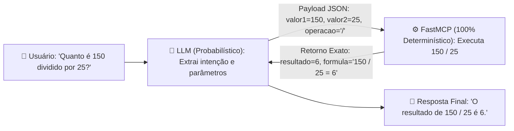
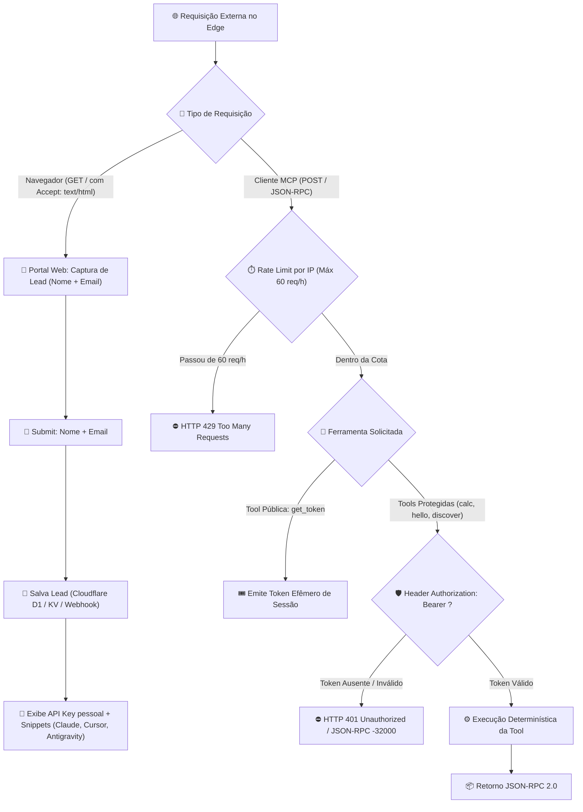

# 📋 Especificação e Planejamento: Servidor MCP Enterprise em Python (FastMCP)

> **Status:** 100% Implementado, Testado e Deployado no Cloudflare Edge  
> **Nome do Servidor:** `mcp-server-enterprise`  
> **URL de Produção:** `https://mcp-server-enterprise.mardukasoft.online`  
> **Diretório do Código:** `src/mcp_server/`  
> **Arquitetura:** Local-First (FastMCP Stdio) + Serverless Edge (Cloudflare Workers Python)  
> **Paradigma:** 100% Determinístico (Separação estrita entre Cognição e Execução)

---

## 🏛️ 1. Racional de Engenharia (Cognitivo vs. Determinístico)

- **🧠 Camada Cognitiva (LLM):** Responsável apenas por interpretação de linguagem natural, extração de intenções e decisão de qual ferramenta invocar (probabilístico).
- **⚙️ Camada Determinística (FastMCP / Python):** Responsável pela validação estrita de tipos (Pydantic v2), cálculos matemáticos exatos, formatações e regras de negócio sem risco de alucinação (100% determinístico e testável).



---

## 🛠️ 2. Stack Tecnológico

- **Linguagem:** Python 3.10+
- **Framework MCP:** `FastMCP` (via pacote oficial `mcp[cli]`)
- **Validação de Schemas e Tipagem:** `Pydantic v2`
- **Testes Unitários:** `pytest`
- **Transporte Padrão:** `stdio` (comunicação direta de processo via stdin/stdout)

---

## 📂 3. Estrutura de Pastas e Arquivos

```text
mcp-server-enterprise-blueprint/
├── src/
│   └── mcp_server/
│       ├── __init__.py             # Pacote Python
│       ├── server.py               # Ponto de entrada do FastMCP e registro das tools
│       ├── registry.py             # Catálogo estático de metadados, schemas e documentação
│       │
│       ├── schemas/                # 🛡️ Camada de Validação Estrita (Pydantic v2)
│       │   ├── __init__.py
│       │   ├── common.py           # Schemas compartilhados (Documentation, ToolMetadata)
│       │   ├── hello.py            # Schemas de entrada e saída da tool 'hello'
│       │   └── calc.py             # Schemas de entrada e saída da tool 'calc'
│       │
│       └── tools/                  # ⚙️ Camada Determinística (Lógica Pura de Execução)
│           ├── __init__.py
│           ├── discover.py         # Lógica da tool 'discover' (inspeção do registry)
│           ├── hello.py            # Lógica da tool 'hello' (saudação + timestamp ISO)
│           └── calc.py             # Lógica da tool 'calc' (operações aritméticas seguras)
│
├── tests/
│   ├── __init__.py
│   └── test_tools.py               # Testes unitários determinísticos das ferramentas (pytest)
│
├── requirements.txt                # Dependências do projeto
└── pyproject.toml                  # Metadados de empacotamento
```

---

## 🔧 4. Especificação Detalhada das Ferramentas (Tools)

### 1. `discover`
- **Objetivo:** Permite ao LLM inspecionar em tempo de execução o catálogo completo de ferramentas, contratos JSON Schema e diretrizes de uso.
- **Input Schema:** Vazio (`{}`).
- **Output Schema:**
```json
{
  "type": "object",
  "properties": {
    "tools": {
      "type": "array",
      "items": {
        "type": "object",
        "properties": {
          "name": { "type": "string" },
          "description": { "type": "string" },
          "inputSchema": { "type": "object" },
          "outputSchema": { "type": "object" },
          "documentation": { "type": "object" }
        },
        "required": ["name", "description", "inputSchema", "outputSchema", "documentation"]
      }
    },
    "total": { "type": "integer" }
  },
  "required": ["tools", "total"]
}
```
- **Documentação & Exemplos:**
  - *Summary:* "Lista dinamicamente todas as ferramentas, seus contratos e exemplos de chamada."
  - *Usage Guidelines:* "Invoque no início de uma sessão para conhecer as capacidades ativas do servidor."

---

### 2. `hello`
- **Objetivo:** Gera saudação personalizada com carimbo de data e hora do sistema em formato ISO 8601.
- **Input Schema:**
```json
{
  "type": "object",
  "properties": {
    "name": {
      "type": "string",
      "description": "Nome da pessoa ou sistema a ser saudado",
      "minLength": 1
    }
  },
  "required": ["name"],
  "additionalProperties": false
}
```
- **Output Schema:**
```json
{
  "type": "object",
  "properties": {
    "message": { "type": "string", "description": "Mensagem formatada de saudação" },
    "timestamp": { "type": "string", "format": "date-time", "description": "Data e hora ISO 8601" }
  },
  "required": ["message", "timestamp"]
}
```
- **Documentação & Exemplos:**
  - *Summary:* "Gera saudação personalizada com carimbo temporal do sistema."
  - *Exemplo Input:* `{"name": "Eduardo"}`
  - *Exemplo Output:* `{"message": "Olá, Eduardo! Servidor MCP Enterprise operacional.", "timestamp": "2026-09-11T22:15:00.000Z"}`

---

### 3. `calc`
- **Objetivo:** Executa operações matemáticas determinísticas (`+`, `-`, `*`, `/`) entre dois números com tratamento estrito de divisão por zero.
- **Input Schema:**
```json
{
  "type": "object",
  "properties": {
    "valor1": { "type": "number", "description": "Primeiro valor numérico" },
    "valor2": { "type": "number", "description": "Segundo valor numérico (não pode ser zero em divisão)" },
    "operacao": {
      "type": "string",
      "description": "Operador matemático",
      "enum": ["+", "-", "*", "/", "soma", "subtracao", "multiplicacao", "divisao"]
    }
  },
  "required": ["valor1", "valor2", "operacao"],
  "additionalProperties": false
}
```
- **Output Schema:**
```json
{
  "type": "object",
  "properties": {
    "resultado": { "type": "number", "description": "Resultado numérico exato" },
    "formula": { "type": "string", "description": "Expressão resolvida (ex: '150 / 25 = 6')" }
  },
  "required": ["resultado", "formula"]
}
```
- **Documentação & Exemplos:**
  - *Summary:* "Calculadora aritmética determinística para cálculos exatos e seguros."
  - *Usage Guidelines:* "O LLM DEVE delegar qualquer cálculo para esta ferramenta para eliminar alucinações matemáticas."
  - *Exemplo 1:* `{"valor1": 150, "valor2": 25, "operacao": "/"}` ➔ `{"resultado": 6.0, "formula": "150 / 25 = 6"}`
  - *Exemplo 2:* `{"valor1": 10.5, "valor2": 3.2, "operacao": "+"}` ➔ `{"resultado": 13.7, "formula": "10.5 + 3.2 = 13.7"}`

---

## 🧪 5. Plano de Testes Unitários (`tests/test_tools.py`)

1. **`test_discover`**: Assegura que o retorno contém exatamente as 3 ferramentas (`discover`, `hello`, `calc`) com seus schemas e documentações íntegros.
2. **`test_hello`**: Assegura formatação da string e validade do timestamp ISO 8601 retornado.
3. **`test_calc_operacoes_validas`**: Testa soma, subtração, multiplicação e divisão com números inteiros e decimais.
4. **`test_calc_divisao_por_zero`**: Assegura que `valor2 = 0` na divisão levanta erro estruturado (`ValueError` tratado).
5. **`test_calc_operacao_invalida`**: Assegura que operadores fora do enum são rejeitados na validação do Pydantic.

---

## 🔐 6. Arquitetura de Autenticação, Portal de Leads e Segurança

### 6.1. Racional de Engenharia e Visão Geral
O servidor MCP exposto publicamente no domínio `https://mcp-server-enterprise.mardukasoft.online` opera como um **portal completo de infraestrutura para IA**, combinando:
1. **Camada Web / Portal de Leads:** Renderização de Landing Page moderna no `GET /` para desenvolvedores gerarem suas API Keys informando Nome e E-mail.
2. **Camada de Proteção Perimetral (Rate Limit):** Limite determinístico de **60 requisições/hora por IP** no Edge.
3. **Camada Protocolar MCP Protegida:** Execução de ferramentas condicionada a **Bearer Token** (`Authorization: Bearer <TOKEN>`) ou emissão de token via ferramenta autônoma `get_token`.



### 6.2. Portal Web & Captura de Leads (`GET /`)
- **Detecção de Navegador:** Se a requisição contiver `Accept: text/html`, o Worker responde com uma página HTML/CSS moderna (Dark Mode, Glassmorphism).
- **Formulário de Entrada:**
  - `Nome Completo`
  - `E-mail Corporativo / Pessoal`
- **Ação:** O usuário clica em **[ Gerar Minha API Key Gratuita ]**.
- **Resposta Instantânea:**
  - Exibição da chave gerada: `mcp_live_xxxxxxxxxxxxxxxx`
  - Bloco de configuração em JSON pronto para colar no `mcp_config.json`, `claude_desktop_config.json` ou `Cursor`.
- **Persistência do Lead:** Gravação no Cloudflare D1/KV e/ou disparo de Webhook para CRM/Notificação.

### 6.3. Rate Limiting por IP (60 chamadas / IP / hora)
- **Extração de IP:** Obtido diretamente do header de borda da Cloudflare (`request.headers.get("CF-Connecting-IP")`).
- **Contador no Edge KV:**
  - Chave: `ratelimit:{client_ip}:{yyyyMMddHH}`
  - TTL: 3600 segundos (1 hora).
- **Ação ao Exceder Limite:**
  - Retorno imediato `HTTP 429 Too Many Requests` com mensagem orientando o usuário a obter uma API Key no portal.

### 6.4. Ferramenta Autônoma de Autenticação (`get_token`)
Para permitir que agentes de IA e clientes programáticos obtenham tokens de sessão de forma autônoma:
- **Status:** Tool Pública (isenta de Bearer Token prévio).
- **Input Schema:**
  ```json
  {
    "type": "object",
    "properties": {
      "client_name": { "type": "string", "description": "Identificação do cliente ou agente" }
    },
    "required": ["client_name"]
  }
  ```
- **Output:** Token efêmero de sessão com expiração e cota controlada.

### 6.5. Estrutura do Header de Autenticação
As requisições autenticadas para o endpoint HTTP / Edge devem conter:
```http
Authorization: Bearer <SEU_TOKEN_SECRETO_ENTERPRISE>
```
*(Alternativa aceita via header secundário: `x-api-key: <TOKEN>`)*

### 6.6. Armazenamento Seguro de Segredos
- **Ambiente de Produção (Cloudflare Edge):** A chave de API mestra é injetada como segredo encriptado via Wrangler:
  ```bash
  npx wrangler secret put MCP_API_KEY
  ```
- **Ambiente de Desenvolvimento / Testes (.env / Local):**
  - Variável `MCP_API_KEY` configurada no ambiente local para testes.

### 6.7. Tratamento de Erros e Códigos de Status
Quando o token estiver ausente, incorreto ou o limite for excedido:
- **HTTP 401 Unauthorized (Token Inválido ou Ausente):**
  ```json
  {
    "jsonrpc": "2.0",
    "id": null,
    "error": {
      "code": -32000,
      "message": "Acesso não autorizado: Bearer Token ausente ou inválido. Obtenha sua chave em https://mcp-server-enterprise.mardukasoft.online"
    }
  }
  ```
- **HTTP 429 Too Many Requests (Rate Limit Excedido):**
  ```json
  {
    "jsonrpc": "2.0",
    "id": null,
    "error": {
      "code": -32029,
      "message": "Limite de requisições atingido: máximo de 60 chamadas por hora por IP."
    }
  }
  ```

### 6.8. Plano de Implementação
1. **Página Web no `src/entry.py`:** Handler para renderizar a interface de Lead Capture em HTML/CSS/JS quando `Accept: text/html`.
2. **Middleware de Rate Limiting & Auth:** Validação do limite de 60 req/h por IP e verificação de `Authorization: Bearer <TOKEN>`.
3. **Tool `get_token`:** Criação do schema e tool determinística em `src/mcp_server/tools/get_token.py`.
4. **Atualização dos Scripts e Testes (`tests/test_auth.py`, `scripts/control.ps1`):** Suporte total ao envio e validação de tokens e rate limits.

