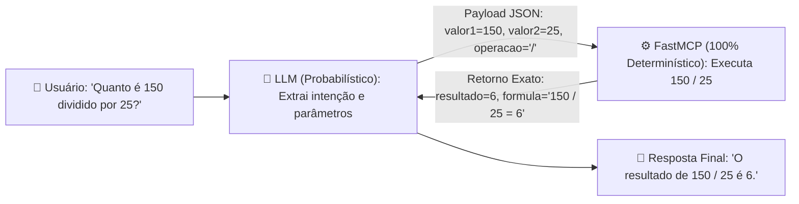
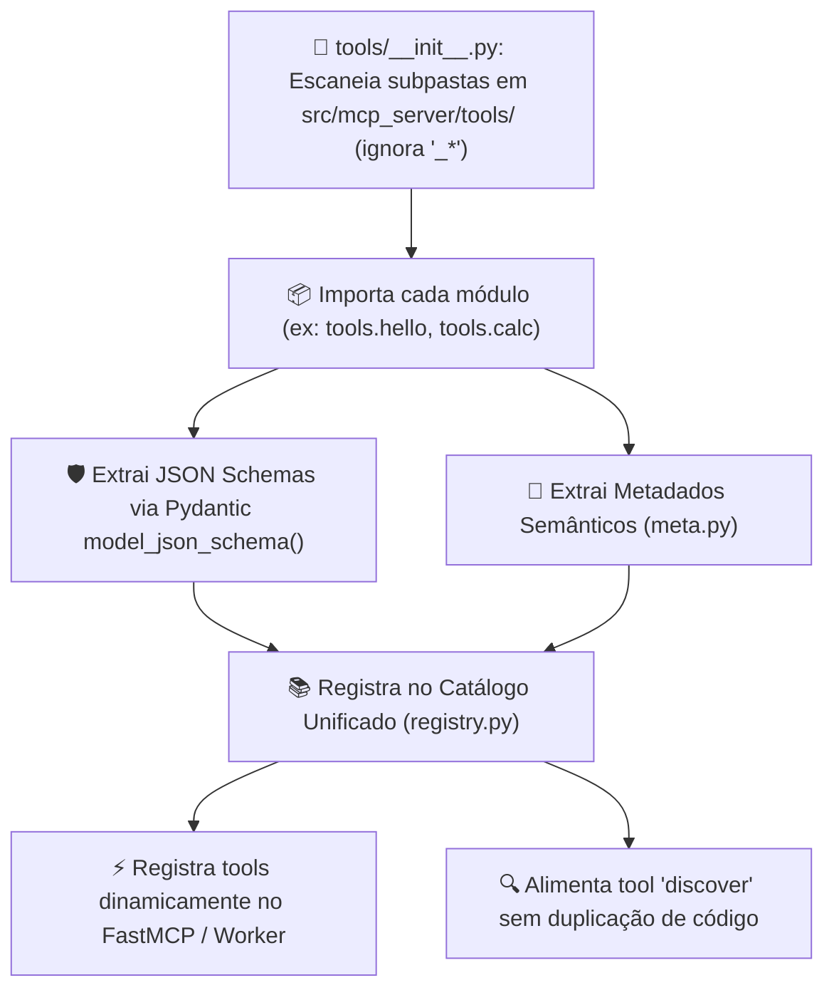
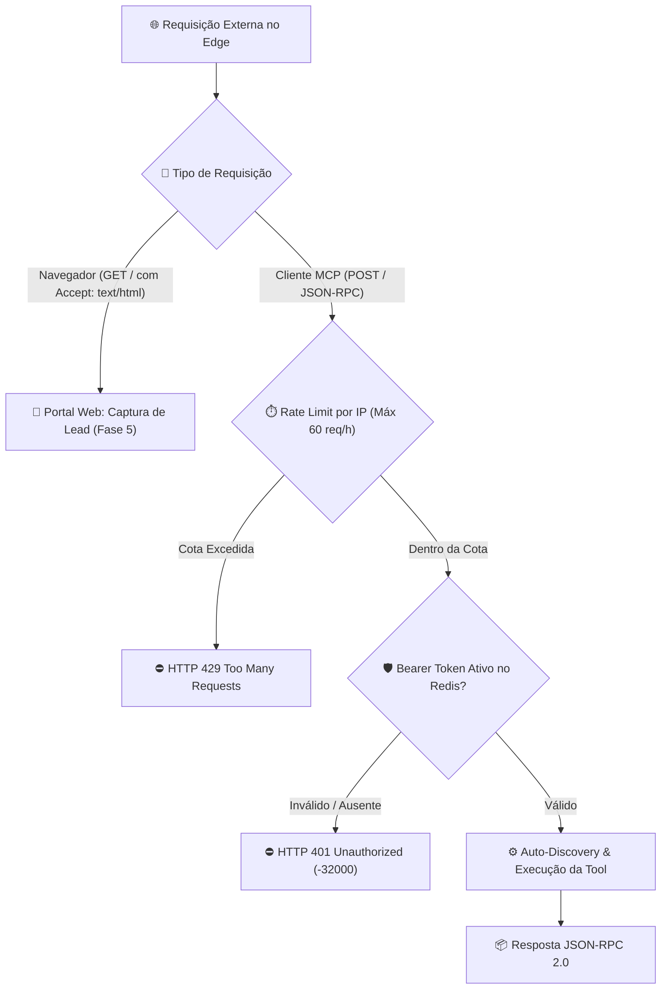

# 📋 Especificação e Planejamento: Servidor MCP Enterprise em Python (FastMCP)

> **Status:** 100% Implementado, Testado e Validado  
> **Nome do Servidor:** `mcp-server-enterprise`  
> **URL de Produção:** `https://mcp-server-enterprise.mardukasoft.online`  
> **Diretório do Código:** `src/mcp_server/`  
> **Arquitetura:** Local-First (FastMCP Stdio) + Serverless Edge (Cloudflare Workers Python)  
> **Paradigma:** 100% Determinístico (Separação estrita entre Cognição e Execução)

---

## 🏛️ 1. Racional de Engenharia (Cognitivo vs. Determinístico)

- **🧠 Camada Cognitiva (LLM):** Responsável pela interpretação de linguagem natural, extração de intenções do usuário e decisão semântica de qual ferramenta invocar (probabilístico).
- **⚙️ Camada Determinística (FastMCP / Python):** Responsável pela validação estrita de contratos (Pydantic v2), execução isolada de código, cálculos exatos e retorno previsível sem risco de alucinação (100% determinístico e testável).



---

## 🛠️ 2. Stack Tecnológico

- **Linguagem:** Python 3.10+
- **Framework MCP:** `FastMCP` (via pacote oficial `mcp[cli]`)
- **Validação de Schemas e Tipagem:** `Pydantic v2` (com geração nativa de JSON Schema)
- **Auto-Discovery & Registry:** Mecanismo dinâmico baseado em introspecção modular (`pkgutil` / `importlib` / `pathlib`)
- **Scaffolding de Tools:** Script CLI auxiliar `scripts/create_tool.py` e template canônico `src/mcp_server/tools/_template/`
- **Calibração de Agentes:** Instruções integradas em `.agents/skills/control-server-entreprise/SKILL.md`
- **Testes Unitários:** `pytest`
- **Transportes Suportados:** `stdio` (local) e `HTTP JSON-RPC 2.0` (Cloudflare Workers Edge)

---

## 📂 3. Nova Arquitetura Modular de Ferramentas (Screaming Architecture)

Para evitar arquivos monolíticos e eliminar a dispersão de código, cada ferramenta é um **módulo isolado e autocontido** dentro de `src/mcp_server/tools/`:

```text
mcp-server-enterprise-blueprint/
├── src/
│   └── mcp_server/
│       ├── __init__.py             # Pacote principal
│       ├── server.py               # Ponto de entrada FastMCP e registro dinâmico via discovery
│       ├── registry.py             # Gerenciador do catálogo dinâmico de tools e schemas
│       ├── security.py             # Guarda perimetral de autenticação Bearer e Rate Limiting
│       │
│       ├── schemas/                # 🛡️ Schemas Globais e Modelos Base
│       │   ├── __init__.py
│       │   ├── base.py             # BaseModel / Field (com fallback leve de borda)
│       │   └── common.py           # Modelos de catálogo (ToolDefinition, DocumentationDefinition)
│       │
│       └── tools/                  # ⚙️ Módulos Autocontidos das Ferramentas (Auto-Discovery)
│           ├── __init__.py         # Mecanismo de varredura e carregamento dinâmico
│           │
│           ├── _template/          # 📐 Template Canônico de Referência (Ignorado pelo Loader)
│           │   ├── README.md       # Guia rápido de replicação da estrutura
│           │   ├── __init__.py     # Exportador de exemplo
│           │   ├── handler.py      # Função execute() boilerplate
│           │   ├── schema.py       # Pydantic Input/Output boilerplate
│           │   └── meta.py         # Metadados e exemplos de uso
│           │
│           ├── discover/           # 🔍 Tool de Auto-Inspeção do Catálogo
│           │   ├── __init__.py     # Exporta handler, schema e metadados
│           │   ├── handler.py      # Execução determinística da inspeção
│           │   ├── schema.py       # Input/Output Pydantic schemas
│           │   └── meta.py         # Resumo semântico, diretrizes e exemplos
│           │
│           ├── hello/              # 👋 Tool de Saudação e Temporalidade
│           │   ├── __init__.py
│           │   ├── handler.py
│           │   ├── schema.py
│           │   └── meta.py
│           │
│           ├── calc/               # 🧮 Tool de Cálculos Aritméticos
│           │   ├── __init__.py
│           │   ├── handler.py
│           │   ├── schema.py
│           │   └── meta.py
│           │
│           └── [nova_tool]/        # 🚀 Nova Tool Plug-and-Play (Criada via script ou cópia)
│               ├── __init__.py
│               ├── handler.py
│               ├── schema.py
│               └── meta.py
│
├── .agents/
│   └── skills/
│       └── control-server-entreprise/ # 🎛️ Skill de Controle e Criação de Tools Calibrada
│           └── SKILL.md
│
├── tests/                          # 🧪 Suíte de Testes Automatizados
│   ├── __init__.py
│   ├── test_discovery.py           # Testes de auto-carregamento e integridade do catálogo
│   ├── test_tools.py               # Testes unitários das ferramentas (hello, calc, discover)
│   └── test_security.py            # Testes de autenticação Bearer e Rate Limit
│
├── scripts/
│   ├── call_tool.py                # Cliente CLI para testes pontuais
│   └── create_tool.py              # Gerador de Scaffold automático de novas tools
├── requirements.txt
└── pyproject.toml
```

---

## 🔄 4. Mecanismo de Auto-Discovery e Eliminação de Redundância (Zero-Drift)

### 4.1. O Problema da Duplicação Manual (Modelo Anterior)
No modelo anterior, adicionar uma nova ferramenta exigia replicar informações em 4 lugares distintos:
1. Código em `tools/nome.py`
2. Schemas Pydantic em `schemas/nome.py`
3. JSON Schema manual e descrições em strings em `registry.py`
4. Registro de função e tipos no `@mcp.tool` em `server.py`

### 4.2. A Solução Dinâmica (Novo Padrão)
1. **Schema Nativo:** `inputSchema` e `outputSchema` são obtidos diretamente de `InputModel.model_json_schema()` e `OutputModel.model_json_schema()`.
2. **Documentação e Diretrizes:** Definidas em `meta.py` ou extraídas das docstrings do `handler.py`.
3. **Varredura Automática:** O carregador em `tools/__init__.py` detecta qualquer nova subpasta (ignorando as iniciadas por `_`), importa os contratos e os disponibiliza automaticamente para o FastMCP e para a tool `discover`.



---

## 📐 5. Template Canônico e Scaffold Automatizado

### 5.1. O Contrato dos 4 Arquivos (`src/mcp_server/tools/_template/`)

Toda ferramenta implementa 4 arquivos padrão dentro de sua respectiva pasta:

#### 1. `schema.py` (Contratos Pydantic)
```python
from ...schemas.base import BaseModel, Field

class MinhaToolInput(BaseModel):
    parametro: str = Field(
        ...,
        min_length=1,
        description="Descrição clara do parâmetro para o LLM",
        examples=["exemplo_1", "exemplo_2"],
    )

class MinhaToolOutput(BaseModel):
    resultado: str = Field(..., description="Resultado formatado da execução")
```

#### 2. `handler.py` (Lógica Determinística)
```python
from .schema import MinhaToolInput, MinhaToolOutput

def execute(dados: MinhaToolInput) -> MinhaToolOutput:
    """Execução pura e determinística."""
    res = f"Processado: {dados.parametro}"
    return MinhaToolOutput(resultado=res)
```

#### 3. `meta.py` (Metadados e Heurísticas Semânticas para o LLM)
```python
from ...schemas.common import DocumentationDefinition, ExampleDefinition

METADATA = {
    "name": "minha_tool",
    "description": "Descrição clara da finalidade da ferramenta para a camada cognitiva do LLM.",
    "documentation": DocumentationDefinition(
        summary="Resumo funcional objetivo da ferramenta.",
        usageGuidelines="Quando o LLM deve invocar esta ferramenta.",
        examples=[
            ExampleDefinition(
                scenario="Cenário de exemplo de uso",
                input={"parametro": "exemplo_1"},
                expectedOutput={"resultado": "Processado: exemplo_1"},
            )
        ],
    ),
}
```

#### 4. `__init__.py` (Ponto Único de Exportação)
```python
from .handler import execute
from .meta import METADATA
from .schema import MinhaToolInput, MinhaToolOutput

__all__ = ["execute", "MinhaToolInput", "MinhaToolOutput", "METADATA"]
```

### 5.2. Script Gerador de Tools (`scripts/create_tool.py`)
Permite criar uma nova tool com um único comando no terminal:
```powershell
python scripts/create_tool.py cotacao_dolar --desc "Consulta cotação do dólar"
```

---

## 🎛️ 6. Calibração do Agente na Skill (`control-server-entreprise`)

O arquivo [`.agents/skills/control-server-entreprise/SKILL.md`](file:///c:/Users/rezen/Documents/GitHub/mcp-server-enterprise-blueprint/.agents/skills/control-server-entreprise/SKILL.md) foi calibrado com um capítulo dedicado à **Criação e Gestão de Ferramentas**, orientando qualquer agente futuro sobre contratos, template, scaffold e auto-discovery.

---

## 🔧 7. Especificação das Ferramentas Nativas

### 1. `discover`
- **Módulo:** `src/mcp_server/tools/discover/`
- **Objetivo:** Permite ao LLM inspecionar o catálogo completo de ferramentas ativas em tempo de execução.
- **Input:** `{}` (vazio).
- **Output:** Catálogo gerado dinamicamente contendo `total` e `tools` (com seus JSON Schemas nativos e documentação).

### 2. `hello`
- **Módulo:** `src/mcp_server/tools/hello/`
- **Objetivo:** Valida parâmetros de nome e retorna saudação com timestamp ISO 8601.
- **Input:** `name: str (min_length=1)`
- **Output:** `message: str`, `timestamp: str`

### 3. `calc`
- **Módulo:** `src/mcp_server/tools/calc/`
- **Objetivo:** Executa operações aritméticas determinísticas (`+`, `-`, `*`, `/`) eliminando alucinações matemáticas.
- **Input:** `valor1: float`, `valor2: float`, `operacao: OperacaoEnum`
- **Output:** `resultado: float`, `formula: str`

### 4. `sqlite`
- **Módulo:** `src/mcp_server/tools/sqlite/`
- **Objetivo:** Executa operações de banco de dados SQLite determinísticas (CRUD: query, insert, select, update, delete).
- **Input:** `action: SqliteAction`, `query: Optional[str]`, `table: Optional[str]`, `data: Optional[dict]`, `where: Optional[dict | str]`, `params: Optional[list | dict]`, `limit: int`, `db_name: str`
- **Output:** `success: bool`, `message: str`, `rows: list[dict]`, `rows_affected: int`, `last_row_id: Optional[int]`, `columns: list[str]`

---

## 🔐 8. Arquitetura de Autenticação, Rate Limiting & Segurança

### 8.1. Visão Geral Perimetral
O servidor exposto no Cloudflare Edge aplica proteção em camadas:
1. **Rate Limit Perimetral:** Máximo de **60 requisições/hora por IP** (`CF-Connecting-IP`). Retorno `HTTP 429` com código `-32029`.
2. **Bearer Token Guard:** Verificação estrita de cabeçalho `Authorization: Bearer <TOKEN>`.
3. **Validação Dinâmica no Redis:** Consulta instantânea $O(1)$ em `auth:token:<token>`. Retorno `HTTP 401` com código `-32000` em caso de token inválido, expirado ou ausente.



---

## 🧪 9. Plano de Testes Automatizados (`pytest`)

1. **`test_discovery_loader`**: Valida se todas as pastas em `tools/` são descobertas e carregadas sem erros de import e se pastas iniciadas por `_` (como `_template`) são ignoradas.
2. **`test_schema_generation`**: Garante que `model_json_schema()` do Pydantic gera `inputSchema` e `outputSchema` válidos.
3. **`test_scaffold_generator`**: Testa a criação de uma tool temporária via `scripts/create_tool.py` e sua validação pelo discovery.
4. **`test_tools_execution`**: Executa testes funcionais para `hello`, `calc` e `discover`.
5. **`test_security_bearer`**: Testa rejeição de requisições sem token ou com token inválido.
6. **`test_rate_limiting`**: Simula mais de 60 requisições para um mesmo IP e valida o bloqueio `429`.

---

## 📋 10. To-Do List — Roadmap de Implementação

### 📐 Fase 1: Template Canônico e Script de Scaffold (Concluída ✅)
- [x] **Task 1.1 — Criação da pasta `src/mcp_server/tools/_template/`:**
  - [x] Criar `schema.py`, `handler.py`, `meta.py`, `__init__.py` e `README.md`.
- [x] **Task 1.2 — Implementação de `scripts/create_tool.py`:**
  - [x] Criar gerador CLI com suporte a `--name`, `--desc` e formatação de templates.
- [x] **Task 1.3 — Calibração da Skill `.agents/skills/control-server-entreprise/SKILL.md`:**
  - [x] Adicionar seção de desenvolvimento e criação de novas ferramentas.

### 🚀 Fase 2: Refatoração Modular das Tools Existentes (Concluída ✅)
- [x] **Task 2.1 — Migração da Tool `hello`:**
  - [x] Criar pasta `src/mcp_server/tools/hello/` (`schema.py`, `handler.py`, `meta.py`, `__init__.py`).
- [x] **Task 2.2 — Migração da Tool `calc`:**
  - [x] Criar pasta `src/mcp_server/tools/calc/` (`schema.py`, `handler.py`, `meta.py`, `__init__.py`).
- [x] **Task 2.3 — Migração da Tool `discover`:**
  - [x] Criar pasta `src/mcp_server/tools/discover/` (`schema.py`, `handler.py`, `meta.py`, `__init__.py`).

### 🔍 Fase 3: Mecanismo de Auto-Discovery e Registry Dinâmico (Concluída ✅)
- [x] **Task 3.1 — Loader em `src/mcp_server/tools/__init__.py`:**
  - [x] Escanear subdiretórios de `tools/` (filtrando pastas `_*`), extraindo metadados, schemas e funções `execute`.
- [x] **Task 3.2 — Refatorar `src/mcp_server/registry.py`:**
  - [x] Gerar catálogo dinâmico via `model_json_schema()` e implementar função `dispatch_tool(name, args)`.
- [x] **Task 3.3 — Refatorar `src/mcp_server/server.py` & `src/entry.py`:**
  - [x] Integrar carregamento dinâmico no FastMCP e no handler do Cloudflare Worker.
- [x] **Task 3.4 — Limpeza dos arquivos legados:**
  - [x] Remover `tools/hello.py`, `tools/calc.py`, `tools/discover.py`, `schemas/hello.py`, `schemas/calc.py`.

### 🧪 Fase 4: Validação, Testes e Integração Edge (Concluída ✅)
- [x] **Task 4.1 — Suíte de Testes Automatizados (`pytest`):**
  - [x] Criar `tests/test_discovery.py` e atualizar `tests/test_tools.py` e `tests/test_mcp_server.py`.
  - [x] Executar suíte completa de testes via `pytest` (42/42 aprovados).
- [x] **Task 4.2 — Smoke Test End-to-End:**
  - [x] Validar chamadas com `scripts/call_tool.py`.

### 🔐 Fase 5: Portal Web, Autenticação e Gestão de Tokens (Concluída ✅)
> *Especificação Técnica Completa:* [docs/portal-web-lead-capture.md](file:///c:/Users/rezen/Documents/GitHub/mcp-server-enterprise-blueprint/docs/portal-web-lead-capture.md)
- [x] **Task 5.1 — Template Visual HTML/CSS (Concluído ✅):**
  - [x] Template de autenticação em [`src/mcp_server/ui/portal.py`](file:///c:/Users/rezen/Documents/GitHub/mcp-server-enterprise-blueprint/src/mcp_server/ui/portal.py) e [`DEV/LP/auth.html`](file:///c:/Users/rezen/Documents/GitHub/mcp-server-enterprise-blueprint/DEV/LP/auth.html).
- [x] **Task 5.2 — Implementação da Tool `redis` & Conexão Edge (Concluído ✅):**
  - [x] Gerenciador de conexão com suporte híbrido: **Upstash REST API** para Cloudflare Workers + **In-Memory Engine** para testes locais.
  - [x] Suporte determinístico a `PING` (handshake e telemetria de latência), `GET`, `SET` (com `ex`/TTL), `DEL`, `EXISTS`, `EXPIRE`, `TTL`, `KEYS`, `HSET`, `HGET`, `HGETALL`, `HDEL`, `SADD`, `SMEMBERS`.
  - [x] Cobertura de testes automatizados em [`tests/test_redis_tool.py`](file:///c:/Users/rezen/Documents/GitHub/mcp-server-enterprise-blueprint/tests/test_redis_tool.py) com 100% de aprovação.
- [x] **Task 5.3 — Implementação da Tool `auth` com Backend Redis (Concluído ✅):**
  - [x] Ações `setup`, `token_generator`, `set_token`, `get_token` e persistência de **Nome e E-mail** nas chaves `auth:user:{email}`, `auth:token:{token}` e `auth:users:index`.
  - [x] Validação dinâmica de Bearer Tokens integrada na guarda perimetral `security.py`.
- [x] **Task 5.4 — Implementação da Tool `send_mail` via Resend API & Gmail (Concluído ✅):**
  - [x] Disparo transacional de e-mails em HTML e texto puro via **Resend REST API (HTTPS)** no Edge e **Gmail SMTP SSL**, com suporte assíncrono nativo (`execute_async`) via `js.fetch`.
- [x] **Task 5.5 — Integração no Edge Worker & Google OAuth2 GIS (`src/entry.py`) (Concluído ✅):**
  - [x] Servir interface em `GET /` com negociação de conteúdo `Accept: text/html` e endpoints `POST /api/auth/login` e `POST /api/auth/google`.
  - [x] Integração do SDK oficial Google Identity Services (GIS).
  - [x] Validação dinâmica de Bearer Tokens no perímetro via `auth.get_token()` no Redis.
  - [x] Segurança perimetral com zero-leak de tokens na interface pública e no payload REST.
- [x] **Task 5.6 — Suíte de Testes Integrada (`pytest`) (Concluído ✅):**
  - [x] 74 testes automatizados cobrindo todas as tools, autenticação, redis, envio de e-mails e portal UI com 100% de aprovação.
