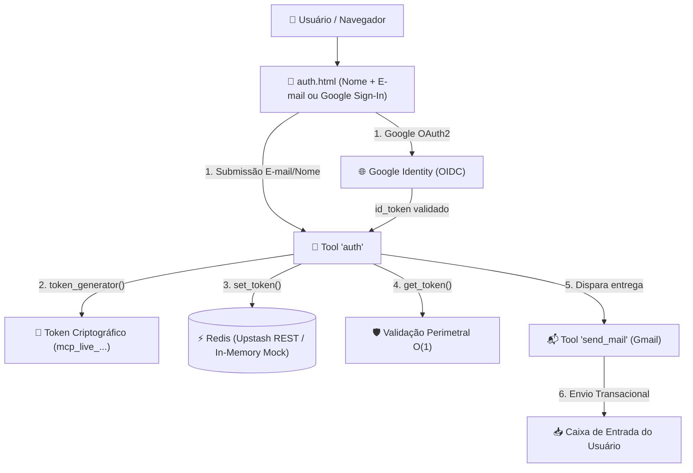

# 🎨 Especificação Técnica: Sistema de Autenticação, Gestão de Tokens & Envio de E-mails

> **Status:** Especificado e Planejado 📋  
> **Servidor:** `mcp-server-enterprise`  
> **Ambiente de Execução:** Cloudflare Workers Python (Edge)  
> **Skills Aplicadas:** `/auth-implementation-patterns` · `/email-systems` · `/google-docs-automation`  
> **Documento Principal:** [docs/mcp-python-fastmcp-plan.md](file:///c:/Users/rezen/Documents/GitHub/mcp-server-enterprise-blueprint/docs/mcp-python-fastmcp-plan.md)  
> **Objetivo:** Implementar arquitetura desacoplada para emissão de tokens de acesso, validação, login social com Google e entrega de credenciais por e-mail.

---

## 🏛️ 1. Arquitetura Modular & Separação de Domínios

Para manter o princípio da responsabilidade única (Single Responsibility Principle) e garantir persistência distribuída no Edge Serverless (Cloudflare Workers), o sistema utiliza Redis como backend primário:

* **⚡ Tool `redis`:** Utilitário de persistência e cache chave-valor (operações `GET`, `SET`, `DEL`, `HGETALL`, `HSET`, `EXPIRE`, `KEYS` e `PING` com suporte nativo a Upstash REST API e In-Memory Engine).
* **🔐 Tool `auth`:** Especialista em ciclo de vida de identidade, emissão e validação de tokens perimetrais $O(1)$ no Redis.
* **📬 Tool `send_mail`:** Especialista em disparo de e-mails transacionais (entrega de tokens via Gmail).
* **🌐 Google OAuth2 / OIDC:** Integração de autenticação social delegada.



---

## 🔐 2. Especificação da Tool `auth` (Persistência em Redis)

A ferramenta **`auth`** encapsula as 4 operações fundamentais de gestão de acesso:

### 2.1. Operações Suportadas (`action`)
1. **`setup`:** Testa a conectividade com o Redis (`PING`) e inicializa os índices/namespaces essenciais.
2. **`token_generator`:** Geração de chaves Bearer criptograficamente seguras com prefixo padronizado (`mcp_live_<hex32>`).
3. **`set_token` (Cadastro de Usuário):** Registra o usuário em `auth:user:{email}` (Hash) e mapeia `auth:token:{token}` com status `'active'`.
4. **`get_token` (Validação de Token):** Consulta `auth:token:{token}` em $O(1)$ no Redis e retorna os dados do titular e validade.

### 2.2. Modelagem Chave-Valor no Redis
```text
Chave: auth:token:{token}
Tipo: String (JSON)
Valor: {"email": "eduardo@empresa.com", "name": "Eduardo Rezende", "status": "active", "provider": "local"}

Chave: auth:user:{email}
Tipo: Hash
Campos: name, email, token, provider, google_id, status, created_at, last_login_at

Chave: auth:users:index
Tipo: Set
Membros: ["eduardo@empresa.com", ...]
```

### 2.3. Contratos da Tool `auth`
```python
class AuthAction(str, Enum):
    SETUP = "setup"
    TOKEN_GENERATOR = "token_generator"
    SET_TOKEN = "set_token"
    GET_TOKEN = "get_token"

class AuthInput(BaseModel):
    action: AuthAction
    name: Optional[str] = None
    email: Optional[str] = None
    token: Optional[str] = None
    provider: Optional[str] = "local"
    google_id: Optional[str] = None

class AuthOutput(BaseModel):
    success: bool
    message: str
    token: Optional[str] = None
    user: Optional[Dict[str, Any]] = None
    is_valid: Optional[bool] = None
```

---

## 📬 3. Especificação da Tool `send_mail` (Gmail Integration)

A ferramenta **`send_mail`** é responsável pelo envio direto e sem atrito do Bearer Token utilizando **Gmail** (via SMTP SSL nativo do Python ou Gmail API):

### 3.1. Funcionalidades
* **Autenticação Direta no Gmail:** Utiliza `GMAIL_USER` e `GMAIL_APP_PASSWORD` (Senha de App do Google) configuradas no ambiente.
* **Template Multipart Elegante:** Envia e-mail formatado em HTML com card visual (e versão texto puro de fallback) contendo o Bearer Token gerado e snippets de configuração para Claude Desktop e Cursor.
* **Transparência e Zero Falsos Positivos:** Sem credenciais configuradas ou em caso de falha de conexão SMTP, retorna `success=False` com erro determinístico para que o chamador e a interface informem com precisão o estado da entrega.

### 3.2. Contratos da Tool `send_mail`
```python
class SendMailInput(BaseModel):
    to_email: str = Field(..., description="E-mail de destino do usuário cadastrado")
    recipient_name: str = Field(..., description="Nome do destinatário")
    token: str = Field(..., description="Bearer Token de acesso gerado para o usuário")
    subject: Optional[str] = Field(
        default="Sua Chave de Acesso · MCP Server Enterprise",
        description="Assunto do e-mail"
    )

class SendMailOutput(BaseModel):
    success: bool = Field(..., description="Indica se o e-mail foi enviado com sucesso")
    message: str = Field(..., description="Mensagem de status do envio via Gmail")
    message_id: Optional[str] = Field(default=None, description="ID da mensagem enviada")
    delivery_mode: str = Field(..., description="Modo de entrega ou status: 'gmail_smtp', 'unconfigured', 'smtp_failed', 'validation_failed'")
    timestamp: str = Field(..., description="Data e hora do envio em ISO 8601 UTC")
    error: Optional[str] = Field(default=None, description="Detalhes do erro em caso de falha")
```

---

## 🌐 4. Especificação do Login Social com Google

1. **Frontend ([`DEV/LP/auth.html`](file:///c:/Users/rezen/Documents/GitHub/mcp-server-enterprise-blueprint/DEV/LP/auth.html)):**
   * Botão *Sign in with Google* aciona o fluxo Google Identity Services (GSI) / OAuth2.
2. **Backend (Edge Worker):**
   * O worker recebe o `credential` (JWT assinado pelo Google).
   * Valida a assinatura do token junto aos endpoints públicos do Google (`https://oauth2.googleapis.com/tokeninfo`).
   * Aciona `dispatch_tool("auth", action="set_token", provider="google", ...)` para vincular o e-mail Google a um Bearer Token do servidor.

---

## 📋 5. Roadmap e Checklist de Implementação (Fase 5)

- [x] **Task 5.1 — Template Visual HTML/CSS (Concluído ✅):**
  - [x] Template de autenticação em [`DEV/LP/auth.html`](file:///c:/Users/rezen/Documents/GitHub/mcp-server-enterprise-blueprint/DEV/LP/auth.html) (Card centralizado, sem senha, nome + e-mail, botão Google SSO e ícone Origami Tech).
- [x] **Task 5.2 — Implementação da Tool `redis` & Conexão Edge (Concluído ✅):**
  - [x] Gerenciador de conexão com suporte híbrido: **Upstash REST API** para Cloudflare Workers + **In-Memory Engine** para testes locais.
  - [x] Suporte determinístico a `PING` (handshake e telemetria de latência), `GET`, `SET` (com `ex`/TTL), `DEL`, `EXISTS`, `EXPIRE`, `TTL`, `KEYS`, `HSET`, `HGET`, `HGETALL`, `HDEL`, `SADD`, `SMEMBERS`.
  - [x] Cobertura de testes unitários automatizados em [`tests/test_redis_tool.py`](file:///c:/Users/rezen/Documents/GitHub/mcp-server-enterprise-blueprint/tests/test_redis_tool.py) com 100% de aprovação.
- [x] **Task 5.3 — Implementação da Tool `auth` com Backend Redis (Concluído ✅):**
  - [x] `schema.py`: Ações `setup`, `token_generator`, `set_token`, `get_token`.
  - [x] `handler.py`: Emissão de token criptográfico (`mcp_live_...`) e persistência determinística de **Nome e E-mail** no Hash `auth:user:{email}`, chave de acesso rápido $O(1)$ `auth:token:{token}` e Set `auth:users:index`.
  - [x] `meta.py` e `__init__.py`: Metadados e registro automático no catálogo FastMCP.
  - [x] Cobertura de testes unitários em [`tests/test_auth_tool.py`](file:///c:/Users/rezen/Documents/GitHub/mcp-server-enterprise-blueprint/tests/test_auth_tool.py) com 100% de aprovação.
- [x] **Task 5.4 — Implementação da Tool `send_mail` via Gmail (Concluído ✅):**
  - [x] `schema.py`: Contratos `SendMailInput` e `SendMailOutput`.
  - [x] `handler.py`: Geração de e-mail multipart (HTML responsivo moderno + texto puro) com suporte a **Gmail SMTP SSL** (`smtp.gmail.com:465`) e tratamento estrito de erros sem mascaramento.
  - [x] `meta.py` e `__init__.py`: Metadados, documentação estendida e registro no FastMCP.
  - [x] Cobertura de testes unitários em [`tests/test_send_mail_tool.py`](file:///c:/Users/rezen/Documents/GitHub/mcp-server-enterprise-blueprint/tests/test_send_mail_tool.py) com 100% de aprovação.
- [x] **Task 5.5 — Integração Google OAuth2 & Handlers no Edge (`src/entry.py`) (Concluído ✅):**
  - [x] Rota `POST /api/auth/login` (fluxo e-mail/nome $\rightarrow$ `auth.set_token` $\rightarrow$ `send_mail`).
  - [x] Rota `POST /api/auth/google` (fluxo de autenticação social com Google).
  - [x] Negociação de conteúdo `Accept: text/html` para servir a interface web na raiz `GET /`.
  - [x] Validação dinâmica de Bearer Tokens no perímetro via `auth.get_token()` no Redis.
- [x] **Task 5.6 — Suíte de Testes Integrada (`pytest`) (Concluído ✅):**
  - [x] 73 testes automatizados cobrindo discovery, tools, redis, auth, send_mail, security e portal UI com 100% de aprovação.
