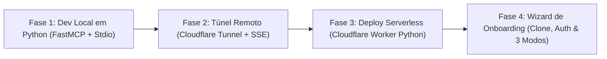
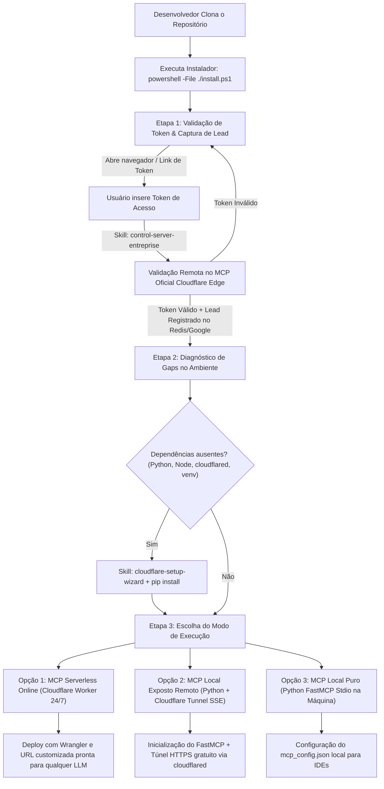

# 📋 Task List: Servidor MCP Enterprise em Python (Local ➔ Cloudflare)

Documento oficial de tarefas do projeto para o servidor **`mcp-server-enterprise`**, padronizado **100% em Python** com separação estrita entre **Camada Cognitiva** e **Camada Determinística**.

---

## 🧭 Visão Geral do Ciclo de Vida (100% Python)



---

## ✅ Fase 1: Desenvolvimento e Testes Locais em Python (Concluída)

- [x] **1.1. Ambiente e Dependências**
  - [x] Criar e ativar ambiente virtual (`.venv`)
  - [x] Configurar [requirements.txt](../requirements.txt) (`fastmcp`, `mcp`, `pydantic`, `pytest`)
  - [x] Configurar [pyproject.toml](../pyproject.toml) com layout `src/` e `[tool.pyright]`
  - [x] Instalar o pacote em modo editável (`pip install -e .`)
- [x] **1.2. Contratos e Validação Estrita (Pydantic v2)**
  - [x] Implementar schemas compartilhados em [src/mcp_server/schemas/common.py](../src/mcp_server/schemas/common.py)
  - [x] Implementar schema da tool `hello` em [src/mcp_server/schemas/hello.py](../src/mcp_server/schemas/hello.py)
  - [x] Implementar schema da tool `calc` com enum de operadores em [src/mcp_server/schemas/calc.py](../src/mcp_server/schemas/calc.py)
- [x] **1.3. Lógica Determinística das Ferramentas**
  - [x] Implementar `execute_discover` em [src/mcp_server/tools/discover.py](../src/mcp_server/tools/discover.py)
  - [x] Implementar `execute_hello` em [src/mcp_server/tools/hello.py](../src/mcp_server/tools/hello.py)
  - [x] Implementar `execute_calc` em [src/mcp_server/tools/calc.py](../src/mcp_server/tools/calc.py)
- [x] **1.4. Servidor FastMCP e Catálogo de Metadados**
  - [x] Criar catálogo com documentação estendida em [src/mcp_server/registry.py](../src/mcp_server/registry.py)
  - [x] Criar ponto de entrada do servidor em [src/mcp_server/server.py](../src/mcp_server/server.py)
- [x] **1.5. Testes e Validação Protocolar**
  - [x] Criar suíte de testes unitários em [tests/test_tools.py](../tests/test_tools.py) e [tests/test_mcp_server.py](../tests/test_mcp_server.py)
  - [x] Executar validação com `pytest` (19/19 testes passaram)
  - [x] Registrar no cliente MCP do projeto ([mcp_config.json](../mcp_config.json) e [.agents/mcp_config.json](../.agents/mcp_config.json))
  - [x] Validar chamada da tool `hello` via protocolo nativo MCP

---

## 🌐 Fase 2: Exposição Remota via Cloudflare Tunnel (`cloudflared` + SSE)

> **Propósito:** Expor o servidor Python FastMCP local diretamente para a internet com HTTPS gratuito e sem abrir portas de roteador.

- [ ] **2.1. Habilitar Transporte SSE no FastMCP**
  - [ ] Adicionar modo de execução HTTP/SSE no `src/mcp_server/server.py` (porta configurável, padrão `8000`)
  - [ ] Iniciar o servidor local em modo SSE: `python -m src.mcp_server.server --transport sse --port 8000`
- [ ] **2.2. Criação do Túnel Cloudflare**
  - [ ] Executar o túnel seguro: `cloudflared tunnel --url http://localhost:8000`
  - [ ] Obter a URL pública gerada (`https://<subdominio>.trycloudflare.com`)
- [ ] **2.3. Validação Remota com Clientes de IA**
  - [ ] Registrar o endpoint SSE (`https://<subdominio>.trycloudflare.com/sse`) no cliente de IA remoto
  - [ ] Realizar teste de invocação das ferramentas (`discover`, `hello`, `calc`) pela internet

---

## ☁️ Fase 3: Deploy Serverless no Cloudflare Worker em Python Nativo (Modo Free)

> **Propósito:** Hospedagem 100% serverless no Edge da Cloudflare em Python (Pyodide), rodando 24/7 sem depender de máquina local.

- [x] **3.1. Configuração do Worker Python**
  - [x] Configurar `wrangler.toml` para runtime Python:
    ```toml
    name = "mcp-server-enterprise"
    main = "src/entry.py"
    compatibility_date = "2024-09-23"
    compatibility_flags = ["python_workers"]
    ```
- [x] **3.2. Entrypoint Serverless em Python (`src/entry.py`)**
  - [x] Implementar o handler `on_fetch(request, env)` conectando as ferramentas determinísticas de `src/mcp_server/tools/`
  - [x] Expor endpoints HTTP (GET info) e JSON-RPC 2.0 (POST /) compatíveis com o protocolo MCP
  - [x] Criar fallback de schemas puro-Python em [src/mcp_server/schemas/base.py](../src/mcp_server/schemas/base.py) para o runtime Pyodide Edge
- [x] **3.3. Deploy e Teste em Produção**
  - [x] Executar o deploy no Edge: `npx wrangler deploy`
  - [x] Configurar domínio customizado no `wrangler.toml`: `mcp-server-enterprise.mardukasoft.online`
  - [x] Obter a URL de produção: `https://mcp-server-enterprise.mardukasoft.online`
  - [x] Validar o handshake e as ferramentas em produção via [scripts/test_cloudflare_worker.py](../scripts/test_cloudflare_worker.py) (6/6 testes passaram)

---

## 🚀 Fase 4: Wizard de Onboarding & Instalador Multi-Modal (Clone, Auth & Setup)

> **Propósito:** Permitir que qualquer desenvolvedor clone o repositório blueprint, valide sua licença/token via MCP online central, instale dependências automaticamente e escolha entre 3 modos de execução (Online Serverless, Local Remoto com Túnel ou Local Puro).



- [x] **4.1. Handshake Inicial e Validação Remota de Token (`control-server-entreprise`)**
  - [x] Criar script de instalação interativo [install.ps1](../install.ps1) e [scripts/install_wizard.py](../scripts/install_wizard.py)
  - [x] Implementar abertura automática do navegador ou exibição do link para geração de token do usuário
  - [x] Realizar a chamada determinística de autenticação contra o servidor MCP oficial na Cloudflare (`https://mcp-server-enterprise.mardukasoft.online`)
  - [x] Garantir que o backend central no Cloudflare registre e preserve o lead no Redis/Google com sigilo total (sem expor credenciais no cliente)
- [x] **4.2. Diagnóstico de Gaps de Ambiente & Instalação Automatizada**
  - [x] Sondar automaticamente: versão do Python (>=3.10), `.venv`, `requirements.txt`, `Node.js`, `wrangler` e `cloudflared`
  - [x] Exibir relatório claro de status (instalado vs. ausente)
  - [x] Prompt de confirmação: *"Deseja instalar e configurar as dependências ausentes agora?"*
  - [x] Integrar a skill `cloudflare-setup-wizard` para instalar `cloudflared` via winget/brew e autenticar Wrangler se necessário
- [x] **4.3. Roteamento dos 3 Modos de Execução**
  - [x] **Modo 1 (Cloudflare Worker Serverless):** Explica disponibilidade 24/7 em qualquer LLM (ChatGPT, Claude Web, Gemini, Cursor) e automatiza `wrangler deploy` via `cloudflare-setup-wizard`
  - [x] **Modo 2 (Local Remoto via Túnel Cloudflare):** Explica execução do código local com túnel público HTTPS seguro via `cloudflared tunnel` para conexão com LLMs online
  - [x] **Modo 3 (Local Stdio Puro):** Instalação direta no ambiente local em Python com configuração instantânea de `mcp_config.json` para IDEs (Antigravity, Cursor, Claude Desktop)
- [x] **4.4. Isolamento de Branches e Proteção de Segredos (Leads & Auth)**
  - [x] Manter o repositório público `mcp-server-enterprise-blueprint` limpo de tokens ou credenciais proprietárias
  - [x] Proteger as credenciais de Redis, Google Sheets e Tokens de Auth como *Cloudflare Worker Secrets* no servidor de produção central
  - [x] Criar branch de desenvolvimento interno / documentação de gestão de leads privada para controle do proprietário

---

## 🔒 Fase 5: Blindagem Perimetral (RBAC) & Token Único MARDUKA (Concluída)

- [x] **5.1. Controle de Acesso Baseado em Papéis (RBAC no Edge)**
  - [x] Separação estrita entre ferramentas públicas (`calc`, `hello`, `discover`, `benchmark_cost`, `sqlite`) e administrativas restritas (`auth`, `redis`, `send_mail`)
  - [x] Bloqueio determinístico perimetral no `tools/call` com HTTP 403 / JSON-RPC `-32003` para perfis `lead`
  - [x] Filtragem dinâmica de catálogo no `tools/list` para ocultar ferramentas administrativas dos clientes/leads
- [x] **5.2. Token Master Único MARDUKA**
  - [x] Padronização de **`MARDUKA`** como o único token mestre do Administrador (`du.rezende@gmail.com`)
  - [x] Expurgados todos os tokens temporários e legados do código, `.env`, `mcp_config.json` e Redis
  - [x] Reset e bootstrap determinístico do banco de dados Redis Upstash
  - [x] Suíte de testes atualizada: 81/81 testes aprovados (`pytest`)
  - [x] Deploy em produção ativo no Cloudflare Workers (`https://mcp-server-enterprise.mardukasoft.online`)


