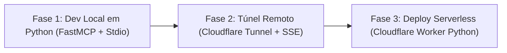

# 📋 Task List: Servidor MCP Enterprise em Python (Local ➔ Cloudflare)

Documento oficial de tarefas do projeto para o servidor **`mcp-server-enterprise`**, padronizado **100% em Python** com separação estrita entre **Camada Cognitiva** e **Camada Determinística**.

---

## 🧭 Visão Geral do Ciclo de Vida (100% Python)



---

## ✅ Fase 1: Desenvolvimento e Testes Locais em Python (Concluída)

- [x] **1.1. Ambiente e Dependências**
  - [x] Criar e ativar ambiente virtual (`.venv`)
  - [x] Configurar [requirements.txt](../requirements.txt) (`fastmcp`, `mcp`, `pydantic`, `pytest`)
  - [x] Configurar [pyproject.toml](../pyproject.toml) com layout `src/` e `[tool.pyright]`
  - [x] Instalar o pacote em modo editável (`pip install -e .`)
- [x] **1.2. Contratos e Validação Estrita (Pydantic v2)**
  - [x] Implementar schemas compartilhados em [src/mcp_server/schemas/common.py](../src/mcp_server/schemas/common.py)
  - [x] Implementar schema da tool `hello` em [src/mcp_server/schemas/hello.py](../src/mcp_server/schemas/hello.py)
  - [x] Implementar schema da tool `calc` com enum de operadores em [src/mcp_server/schemas/calc.py](../src/mcp_server/schemas/calc.py)
- [x] **1.3. Lógica Determinística das Ferramentas**
  - [x] Implementar `execute_discover` em [src/mcp_server/tools/discover.py](../src/mcp_server/tools/discover.py)
  - [x] Implementar `execute_hello` em [src/mcp_server/tools/hello.py](../src/mcp_server/tools/hello.py)
  - [x] Implementar `execute_calc` em [src/mcp_server/tools/calc.py](../src/mcp_server/tools/calc.py)
- [x] **1.4. Servidor FastMCP e Catálogo de Metadados**
  - [x] Criar catálogo com documentação estendida em [src/mcp_server/registry.py](../src/mcp_server/registry.py)
  - [x] Criar ponto de entrada do servidor em [src/mcp_server/server.py](../src/mcp_server/server.py)
- [x] **1.5. Testes e Validação Protocolar**
  - [x] Criar suíte de testes unitários em [tests/test_tools.py](../tests/test_tools.py) e [tests/test_mcp_server.py](../tests/test_mcp_server.py)
  - [x] Executar validação com `pytest` (19/19 testes passaram)
  - [x] Registrar no cliente MCP do projeto ([mcp_config.json](../mcp_config.json) e [.agents/mcp_config.json](../.agents/mcp_config.json))
  - [x] Validar chamada da tool `hello` via protocolo nativo MCP

---

## 🌐 Fase 2: Exposição Remota via Cloudflare Tunnel (`cloudflared` + SSE)

> **Propósito:** Expor o servidor Python FastMCP local diretamente para a internet com HTTPS gratuito e sem abrir portas de roteador.

- [ ] **2.1. Habilitar Transporte SSE no FastMCP**
  - [ ] Adicionar modo de execução HTTP/SSE no `src/mcp_server/server.py` (porta configurável, padrão `8000`)
  - [ ] Iniciar o servidor local em modo SSE: `python -m src.mcp_server.server --transport sse --port 8000`
- [ ] **2.2. Criação do Túnel Cloudflare**
  - [ ] Executar o túnel seguro: `cloudflared tunnel --url http://localhost:8000`
  - [ ] Obter a URL pública gerada (`https://<subdominio>.trycloudflare.com`)
- [ ] **2.3. Validação Remota com Clientes de IA**
  - [ ] Registrar o endpoint SSE (`https://<subdominio>.trycloudflare.com/sse`) no cliente de IA remoto
  - [ ] Realizar teste de invocação das ferramentas (`discover`, `hello`, `calc`) pela internet

---

## ☁️ Fase 3: Deploy Serverless no Cloudflare Worker em Python Nativo (Modo Free)

> **Propósito:** Hospedagem 100% serverless no Edge da Cloudflare em Python (Pyodide), rodando 24/7 sem depender de máquina local.

- [x] **3.1. Configuração do Worker Python**
  - [x] Configurar `wrangler.toml` para runtime Python:
    ```toml
    name = "mcp-server-enterprise"
    main = "src/entry.py"
    compatibility_date = "2024-09-23"
    compatibility_flags = ["python_workers"]
    ```
- [x] **3.2. Entrypoint Serverless em Python (`src/entry.py`)**
  - [x] Implementar o handler `on_fetch(request, env)` conectando as ferramentas determinísticas de `src/mcp_server/tools/`
  - [x] Expor endpoints HTTP (GET info) e JSON-RPC 2.0 (POST /) compatíveis com o protocolo MCP
  - [x] Criar fallback de schemas puro-Python em [src/mcp_server/schemas/base.py](../src/mcp_server/schemas/base.py) para o runtime Pyodide Edge
- [x] **3.3. Deploy e Teste em Produção**
  - [x] Executar o deploy no Edge: `npx wrangler deploy`
  - [x] Configurar domínio customizado no `wrangler.toml`: `mcp-server-enterprise.mardukasoft.online`
  - [x] Obter a URL de produção: `https://mcp-server-enterprise.mardukasoft.online`
  - [x] Validar o handshake e as ferramentas em produção via [scripts/test_cloudflare_worker.py](../scripts/test_cloudflare_worker.py) (6/6 testes passaram)

